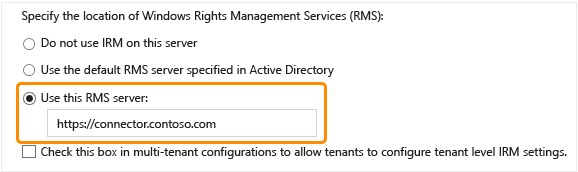

# Łącznik zarządzania Azure prawa wdrażania
Te informacje służą do Dowiedz się więcej o łącznika usługi Microsoft Rights Management (RMS) i jak go używać w celu zapewnienia ochrony informacji z istniejących wdrożeń lokalnych korzystających z programu Microsoft Exchange Server, Microsoft SharePoint Server lub serwerów plików, które należy uruchomić systemu Windows Server i użyć możliwości infrastruktury plików klasyfikacji infrastruktury (FCI) Menedżera zasobów serwera plików.

> [!TIP]
> Scenariusz przykład wysokiego poziomu, zrzuty ekranu, można znaleźć [Automatycznie ochrony plików na serwerach plików z systemem Windows Server i infrastruktury klasyfikacji plików](../Topic/What_is_Azure_Rights_Management_.md#BKMK_Example_FCI) w sekcji [Co to jest Azure Rights Management?](../Topic/What_is_Azure_Rights_Management_.md) tematu.

## <a name="OverviewConnector"></a>Przegląd łącznik Microsoft Rights Management
Łącznik programu Microsoft Rights Management (RMS) pozwala szybko włączyć istniejących serwerów lokalnych do ich funkcje zarządzania prawami do informacji (IRM) za pomocą usługi Microsoft Rights Management oparte na chmurze (usługi Azure RMS). Dzięki tej funkcji IT i użytkownicy mogą łatwo chronić dokumenty i obrazy zarówno wewnątrz organizacji i zewnętrzny, bez konieczności instalowania dodatkowych infrastruktury lub ustanawiania relacji zaufania z innymi organizacjami. Można użyć tego łącznika, nawet w przypadku niektórych użytkowników nawiązywania połączenia z usług online w scenariuszu hybrydowego. Na przykład niektórzy użytkownicy skrzynek pocztowych używanie usługi Exchange Online i użycia w przypadku niektórych użytkowników skrzynek pocztowych programu Exchange Server. Po zainstalowaniu łącznika usług RMS, wszyscy użytkownicy mogą chronić i korzystanie z wiadomości e-mail i załączniki za pomocą usług Azure RMS i ochrony informacji współpracuje między konfiguracje dwa wdrożenia.

Łącznik usług RMS jest usługą małą liczbę zainstalować lokalnie, na serwerach z systemem Windows Server 2012 R2, Windows Server 2012 lub Windows Server 2008 R2. Oprócz łącznik uruchomione na komputerach fizycznych, można również uruchomić je na maszyn wirtualnych, w tym maszyny wirtualne IaaS Azure. Po zainstalowaniu i skonfigurować łącznik działa jako interfejs komunikacji (przekazywanie) między serwerami lokalne i usługa w chmurze.

Jeśli zarządzasz klucz dzierżawcy dla usług Azure RMS (Przełącz własny klucz lub scenariusza BYOK), Łącznik usług RMS i serwerów lokalnych, które go używają nie uzyskać dostępu do sprzętu zabezpieczeń moduły zawierający klucz dzierżawcy. To jest spowodowane wszystkich operacji kryptograficznych, które używają klucza dzierżawy są wykonywane w usług Azure RMS, a nie lokalnie.


Łącznik usług RMS obsługuje następujące serwery lokalne: Exchange Server, SharePoint Server i serwerów plików, które systemem operacyjnym Windows Server i używanie plików klasyfikacji infrastruktury do klasyfikowania i stosować zasady do dokumentów pakietu Office w folderze. Jeśli chcesz chronić wszystkie typy plików za pomocą pliku klasyfikacji, nie należy używać łącznika usług RMS, ale zamiast tego należy użyć [poleceń cmdlet ochrony usług RMS](https://msdn.microsoft.com/library/azure/mt433195.aspx).

> [!NOTE]
> Dla obsługiwanych wersji z tych serwerów lokalnych, zobacz "lokalnych serwerów obsługujących usług Azure RMS" w [Aplikacje, które obsługują Azure RMS](../Topic/Requirements_for_Azure_Rights_Management.md#BKMK_SupportedApplications) części [Wymagania dotyczące systemu Azure Rights Management](../Topic/Requirements_for_Azure_Rights_Management.md) tematu.

Użyj następujące sekcje zawierają informacje ułatwiające planowanie, instalowania i konfigurowania łącznika usług RMS. Następnie należy wykonać niektóre konfiguracji instalacji wpisu, aby serwery można używać łącznika programu.

-   [Prerequisites for the RMS connector](../Topic/Deploying_the_Azure_Rights_Management_Connector.md#BKMK_Prereqs)

-   **Krok 1:**  [Installing the RMS connector](../Topic/Deploying_the_Azure_Rights_Management_Connector.md#BKMK_InstallingConnector)

-   **Krok 2:**  [Entering credentials](../Topic/Deploying_the_Azure_Rights_Management_Connector.md#EnteringCredentials)

-   **Krok 3:**  [Authorizing servers to use the RMS connector](../Topic/Deploying_the_Azure_Rights_Management_Connector.md#AuthorizingServers)

-   **Krok 4:**  [Configuring load balancing and high availability](../Topic/Deploying_the_Azure_Rights_Management_Connector.md#ConfiguringConnector)

-   Opcjonalne: [Configuring the RMS connector to use HTTPS](../Topic/Deploying_the_Azure_Rights_Management_Connector.md#BKMK_ConfiguringHTTPS)

-   Opcjonalne: [Configuring the RMS connector for a web proxy server](../Topic/Deploying_the_Azure_Rights_Management_Connector.md#BKMK_ConfiguringWebProxy)

-   Opcjonalne: [Installing the RMS connector administration tool on administrative computers](../Topic/Deploying_the_Azure_Rights_Management_Connector.md#BKMK_InstallingStandaloneTool)

-   **Krok 5.**  [Configuring servers to use the RMS connector](../Topic/Deploying_the_Azure_Rights_Management_Connector.md#ConfiguringServers)

    -   [Configuring an Exchange server to use the connector](../Topic/Deploying_the_Azure_Rights_Management_Connector.md#BKMK_ExchangeServer)

    -   [Configuring a SharePoint server to use the connector](../Topic/Deploying_the_Azure_Rights_Management_Connector.md#BKMK_ConfiguringSharePoint)

    -   [Configuring a file server for File Classification Infrastructure to use the connector](../Topic/Deploying_the_Azure_Rights_Management_Connector.md#BKMK_FileServer)

-   [Next steps](../Topic/Deploying_the_Azure_Rights_Management_Connector.md#BKMK_NextSteps)

## <a name="BKMK_Prereqs"></a>Wymagania wstępne dotyczące łącznika usług RMS
Przed zainstalowaniem łącznika usług RMS, upewnij się, że zostały spełnione następujące wymagania.

|Wymaganie|Więcej informacji|
|-------------|---------------------|
|Aktywować usługi Rights Management (RMS)|[Aktywowanie Azure Rights Management](../Topic/Activating_Azure_Rights_Management.md)|
|Synchronizacja katalogu lasów usługi Active Directory i usługi Azure Active Directory|Po uaktywnieniu RMS Azure Active Directory muszą być skonfigurowane do pracy z użytkowników i grup w bazie danych usługi Active Directory. **Important:** Należy wykonać ten krok synchronizacji katalogu dla łącznika usług RMS do pracy nawet w przypadku sieci testowej. Chociaż można używać usługi Office 365 i usługi Azure Active Directory przy użyciu konta, które w przypadku ręcznego tworzenia usługi Azure Active Directory, tego łącznika wymaga synchronizację kont w usłudze Azure Active Directory z usług domenowych w usłudze Active Directory; Synchronizacja haseł ręczne nie jest wystarczające.<br />Aby uzyskać więcej informacji zobacz następujące zasoby:<br /><br />-   [Instrukcje dotyczące konfigurowania dzierżawcy usługi Azure AD](http://technet.microsoft.com/library/hh967611.aspx)<br />-   [Instrukcje dotyczące włączania synchronizacji katalogów przy użyciu usługi AAD przy użyciu narzędzia DirSync](http://technet.microsoft.com/library/hh967642.aspx)|
|Opcjonalne, ale zalecane:<br /><br />-   Włączenie federacji między lokalnej usługi Active Directory i usługi Azure Active Directory|Można włączyć federacji tożsamości między katalogu lokalnego i Azure Active Directory. Ta konfiguracja umożliwia aby usprawnić środowisko użytkownika przy użyciu logowania jednokrotnego do usługi RMS. Bez logowania jednokrotnego użytkownicy są monitowani o podanie poświadczeń, aby móc korzystać z zawartości chronionej prawami.<br /><br />Instrukcje dotyczące konfiguracji Federacji za pomocą usługi Active Directory Federation Services (AD FS) między usług domenowych w usłudze Active Directory i usługi Azure Active Directory, zobacz [Lista kontrolna: Pomocą usług AD FS do implementowania i zarządzania logowania jednokrotnego](http://technet.microsoft.com/library/jj205462.aspx) w bibliotece systemu Windows Server.|
|Co najmniej dwóch komputerów będących członkami, na którym chcesz zainstalować Łącznik usług RMS:<br /><br /><ul><li>64-bitowy komputer fizyczny lub wirtualny uruchomiony jeden z następujących systemów operacyjnych:<br /><br /><ul><li>Windows Server 2012 R2</li><li>Windows Server 2012</li><li>Windows Server 2008 R2</li></ul></li><li>Co najmniej 1 GB pamięci RAM</li><li>Co najmniej 64 GB miejsca na dysku</li><li>Co najmniej jeden interfejs sieciowy</li><li>Dostęp do Internetu za pośrednictwem zapory (lub serwera proxy sieci web), który nie wymaga uwierzytelniania</li><li>Musi być w lesie lub domeny, której ufa innych lasów w organizacji, które zawierają instalacji serwerów programu Exchange i SharePoint, które mają być używane z łącznika usług RMS</li></ul>|Odporność na uszkodzenia i wysoką dostępność należy zainstalować Łącznik usług RMS na co najmniej dwóch komputerów. **Tip:** Jeśli używasz programu Outlook Web Access lub urządzeń przenośnych, które używają programu Exchange ActiveSync IRM pamiętać, że obsługa dostępu do wiadomości e-mail i załączniki chronione za pomocą usług Azure RMS, zaleca się wdrożenie równoważeniem obciążenia grupy serwerów łącznika, aby zapewnić wysoką dostępność.<br />Dedykowanych serwerach, aby uruchomić łącznik nie jest konieczne, ale należy ją zainstalować na innym komputerze niż serwery używających łącznika. **Important:** Łącznik nie należy instalować na komputerze z systemem Exchange Server, SharePoint Server lub serwer plików skonfigurowanego dla pliku klasyfikacji infrastruktury, jeśli chcesz skorzystać z funkcji z tych usług za pomocą usług Azure RMS. Ponadto nie należy instalować tego łącznika na kontrolerze domeny.|

## <a name="BKMK_InstallingConnector"></a>Instalowanie łącznika usług RMS
Po potwierdzeniu wymagania wstępne w poprzedniej sekcji, aby zainstalować Łącznik usług RMS, wykonaj następujące instrukcje:

1.  Zidentyfikuj komputery, których będzie uruchamiany łącznik RMS (co najmniej dwa). Muszą spełniać minimalne specyfikacji wymienione w poprzedniej sekcji.

    > [!NOTE]
    > Zainstaluj pojedynczy łącznik RMS (składające się z wielu serwerów w celu zapewnienia wysokiej dostępności) dla tej dzierżawy (dzierżawy usługi Office 365 lub dzierżawy usługi Azure AD). W przeciwieństwie do Active Directory RMS nie musisz zainstalować Łącznik usług RMS w każdym lesie.

2.  Pobierz pliki źródłowe dla łącznika usług RMS z [Microsoft Download Center](http://go.microsoft.com/fwlink/?LinkId=314106).

    Aby zainstalować Łącznik usług RMS, Pobierz RMSConnectorSetup.exe.

    Ponadto:

    -   Jeśli chcesz później skonfigurować łącznik z 32-bitowym komputerze, również pobrać RMSConnectorAdminToolSetup_x86.exe.

    -   Jeśli chcesz użyć narzędzia do konfiguracji serwera łącznika usług RMS, aby zautomatyzować konfigurację ustawień rejestru należy lokalnych serwerach, również pobrać GenConnectorConfig.ps1.

3.  Uruchom na komputerze, na którym chcesz zainstalować Łącznik usług RMS, **RMSConnectorSetup.exe** z uprawnieniami administratora.

4.  Na stronie powitalnej strony Instalatora łącznika zarządzania prawami firmy Microsoft, wybierz **zainstalować Microsoft Rights Management łącznika na komputerze**, a następnie kliknij przycisk **Dalej**.

5.  Przeczytaj i Akceptuję postanowienia licencyjne łącznika usług RMS, a następnie kliknij **Dalej**.

Aby kontynuować, wprowadź konto i hasło, aby skonfigurować łącznik usługi RMS.

## <a name="EnteringCredentials"></a>Wprowadzanie poświadczeń
Przed skonfigurowaniem łącznika usług RMS, wprowadź poświadczenia dla konta, które ma wystarczające uprawnienia do konfigurowania łącznika usług RMS.

Ponadto, jeśli zaimplementowano [formanty dołączania](https://technet.microsoft.com/library/jj658941.aspx), upewnij się, że konto użytkownika jest możliwość ochrony zawartości. Na przykład jeśli ograniczenia możliwość ochrony zawartości do grupy "Działu IT", konto określone w tym miejscu musi być członkiem tej grupy. W przeciwnym razie pojawi się komunikat o błędzie: **Nie można odnaleźć lokalizacji usługi administracji i organizacji. Upewnij się, że usługa Microsoft Rights Management jest włączona dla Twojej organizacji.**

Można użyć konta mającego następujące uprawnienia:

-   **Administrator dzierżawy usługi office 365**: Konta, które administrator globalny dla dzierżawcy usługi Office 365.

-   **Administratora globalnego azure Rights Management**: Konta z uprawnieniami administratora dla dzierżawcy usług Azure RMS.

-   **Łącznik Microsoft RMS administratora**: Konto w usłudze Azure Active Directory, któremu udzielono prawa do instalowania i administrowania łącznika usług RMS dla Twojej organizacji.

    > [!NOTE]
    > Jeśli chcesz użyć konta administratora łącznika programu Microsoft RMS, należy wykonać następujące czynności, aby przypisać rolę administratora łącznika usług RMS:
    > 
    > 1.  Na tym samym komputerze należy pobrać i zainstalować środowisko Windows PowerShell Rights Management. Aby uzyskać więcej informacji, zobacz [Instalowanie programu Windows PowerShell Azure Rights Management](../Topic/Installing_Windows_PowerShell_for_Azure_Rights_Management.md).
    > 
    >     Uruchom program Windows PowerShell z **Uruchom jako administrator** poleceń i połączyć się z usługą Azure RMS za pomocą [Connect AadrmService](https://msdn.microsoft.com/library/azure/dn629415.aspx) polecenia:
    > 
    >     ```
    >     Connect-AadrmService                   //provide Office 365 tenant administrator or Azure RMS global administrator credentials
    >     ```
    > 2.  Następnie uruchom [AadrmRoleBasedAdministrator Dodaj](https://msdn.microsoft.com/library/azure/dn629417.aspx) polecenia przy użyciu tylko jednego z następujących parametrów:
    > 
    >     ```
    >     Add-AadrmRoleBasedAdministrator -EmailAddress <email address> -Role "ConnectorAdministrator"
    >     ```
    > 
    >     ```
    >     Add-AadrmRoleBasedAdministrator -ObjectId <object id> -Role "ConnectorAdministrator"
    >     ```
    > 
    >     ```
    >     Add-AadrmRoleBasedAdministrator -SecurityGroupDisplayName <group Name> -Role "ConnectorAdministrator"
    >     ```
    >     Na przykład wpisz: **Add-AadrmRoleBasedAdministrator -EmailAddress melisa@contoso.com -Role " ConnectorAdministrator "**
    > 
    >     Mimo że te polecenia przy użyciu roli ConnectorAdministrator, można także za pomocą roli GlobalAdministrator, jak również.

W procesie instalacji łącznika usług RMS wszystkie wstępnie wymagane oprogramowanie jest zweryfikowany i instalowany, Internet Information Services (IIS) jest zainstalowana Jeśli nie są już zainstalowane i oprogramowanie łącznika jest zainstalowany i skonfigurowany. Ponadto usług Azure RMS jest przygotowany do konfiguracji, tworząc następujące czynności:

-   Pusta tabela serwerów, które są autoryzowane do korzystania z łącznika do komunikowania się z usługami Azure RMS. Serwery zostaną dodane do tej tabeli później.

-   Zestaw tokeny zabezpieczające łącznika, które zezwalają na stosowanie operacji za pomocą usług Azure RMS. Tokeny te są pobierane z usług Azure RMS i zainstalowane na komputerze lokalnym w rejestrze. Są chronione za pomocą danych interfejsu programowania aplikacji ochrony (DPAPI) oraz poświadczenia konta systemu lokalnego.

Na ostatniej stronie kreatora, wykonaj następujące czynności, a następnie kliknij przycisk **Zakończ**:

-   Jeśli jest to pierwszy łącznik, który został zainstalowany, nie należy wybierać **uruchamiania konsoli administratora łącznika do autoryzowania serwerów** w tej chwili. Po zainstalowaniu drugiego (lub końcowe) łącznika usług RMS będzie wybierz tę opcję. Zamiast tego należy ponownie uruchomić kreatora na co najmniej jednym komputerze. Należy zainstalować co najmniej dwa łączniki.

-   Jeśli zainstalowano łącznik programu drugi (lub końcowych), wybierz **uruchamiania konsoli administratora łącznika do autoryzowania serwerów**.

> [!TIP]
> W tym momencie jest test weryfikacji, które można wykonać, aby sprawdzić, czy działają usługi sieci web dla łącznika usług RMS:
> 
> -   W przeglądarce sieci web nawiązać **http://&lt;connectoraddress&gt;/_wmcs/certification/servercertification.asmx**, zastąpienie *&lt; connectoraddress &gt;* z adresem serwera lub nazwę, która ma zainstalować Łącznik usług RMS. Wyświetla udane połączenie **ServerCertificationWebService** strony.

Jeśli musisz odinstalować łącznik usług RMS, ponownie uruchom kreatora i wybierz opcję odinstalowania.

## <a name="AuthorizingServers"></a>Autoryzowanie serwerów do korzystania z łącznika usług RMS
Po zainstalowaniu łącznika usług RMS na co najmniej dwa komputery, wszystko jest gotowe do autoryzowania serwerów i usług, które chcesz użyć łącznika usług RMS. Na przykład serwery z systemem Exchange Server 2013 lub SharePoint Server 2013.

Aby zdefiniować te serwery, uruchom narzędzie administracyjne łącznika usług RMS i dodać pozycje do listy dozwolonych serwerów. To narzędzie można uruchomić po wybraniu **uruchamiania konsoli administracyjnej łącznika do autoryzowania serwerów** na końcu łącznika Microsoft Rights Management Instalatora Kreatora, lub można uruchomić go oddzielnie z kreatora.

Gdy upoważnisz tych serwerów, należy pamiętać o następujących kwestiach:

-   Serwery, które można dodać zostanie przyznane specjalne uprawnienia. Wszystkie konta, które można określić dla roli serwera programu Exchange w konfiguracji łącznika zostanie przyznany [rolę użytkownika nadrzędnego](https://technet.microsoft.com/library/mt147272.aspx) Azure RMS, który umożliwia im dostęp do całej zawartości dla tej dzierżawy RMS. Funkcja użytkownika nadrzędnego jest automatycznie włączone na tym etapie w razie potrzeby. Aby uniknąć zagrożenia zabezpieczeń podniesienia uprawnień, należy zachować ostrożność Określ konta, które są używane przez serwery Exchange w organizacji. Wszystkie serwery skonfigurowane jako serwery programu SharePoint lub serwerów plików, które używają infrastruktury FCI zostanie przyznane uprawnienia zwykłych użytkowników.

-   Można dodać wiele serwerów jako pojedynczy wpis, określając zabezpieczeń usługi Active Directory lub grupy dystrybucyjnej lub konto usługi, który jest używany przez więcej niż jednego serwera. Podczas używania tej konfiguracji grupy serwerów współużytkują tego samego certyfikatów usług RMS i wszystkie uznaje się właścicieli dla zawartości, która ich chronione. Aby zminimalizować ogólne koszty administracyjne, zalecane jest użycie tej konfiguracji pojedynczej grupy, a nie na poszczególnych serwerach autoryzować serwery Exchange w organizacji lub farmy serwerów programu SharePoint.

Na **serwerów mogą wykorzystywać łącznik** kliknij **Dodaj**.

### <a name="BKMK_AddServer"></a>Dodawanie serwera do listy dozwolonych serwerów
Na **Zezwalaj na korzystanie z łącznika serwera** wprowadź nazwę obiektu lub Przeglądaj, aby zidentyfikować obiekt do autoryzacji.

Należy pamiętać, że autoryzować odpowiedni obiekt. W przypadku serwera do korzystania z łącznika konta, na którym uruchomiona jest usługa lokalnych (na przykład programu Exchange lub SharePoint), należy wybrać autoryzacji. Na przykład jeśli usługa jest uruchomiona jako konto usługi skonfigurowane, Dodaj nazwę tego konta usługi do listy. Jeśli usługa jest uruchomiona jako System lokalny, Dodaj nazwę obiektu komputera (na przykład SERVERNAME$). Najlepszym rozwiązaniem utworzyć grupę, która zawiera te konta, a następnie określ grupę zamiast nazw poszczególnych serwerów.

Więcej informacji na temat innych ról serwerów:

-   W przypadku serwerów z systemem Exchange: Należy określić grupę zabezpieczeń i użyć domyślnej grupy (**Serwery Exchange**) programu Exchange automatycznie tworzy i przechowuje wszystkie serwery Exchange w lesie.

-   W przypadku serwerów z systemem programu SharePoint:

    -   Jeśli serwer programu SharePoint 2010 jest skonfigurowany do uruchamiania jako konto systemu lokalnego (nie używa konta usługi), ręcznie utwórz grupę zabezpieczeń w usługach domenowych w usłudze Active Directory, a następnie dodaj obiekt nazwy komputera dla serwera w tej konfiguracji do tej grupy.

    -   SharePoint server jest skonfigurowany do używania konta usługi (zalecane praktyki dla programu SharePoint 2010) i opcja tylko dla programu SharePoint 2013, należy wykonać następujące czynności:

        1.  Dodaj konto usługi, którym jest uruchomiona Usługa administracji centralnej programu SharePoint do włączenia programu SharePoint można skonfigurować za pomocą jego konsoli administratora.

        2.  Dodaj konto jest skonfigurowane dla puli aplikacji programu SharePoint.

        > [!TIP]
        > Jeśli te dwa konta są różne, należy rozważyć tworzenie pojedynczej grupy, który zawiera oba konta, aby zminimalizować ogólne koszty administracyjne.

-   Dla serwerów plików, które korzystanie z infrastruktury klasyfikacji pliku skojarzone usługi uruchamiane jako konto systemu lokalnego, więc musisz autoryzować konto komputera dla serwerów plików (na przykład SERVERNAME$) lub grupę, która zawiera te konta komputera.

Po zakończeniu dodawania serwerów do listy, kliknij przycisk **Zamknij**.

Jeśli jeszcze tego nie zrobiono, należy teraz skonfigurować Równoważenie obciążenia dla serwerów, które zostały zainstalowane łącznika usług RMS i rozważyć, czy dla połączeń między te serwery i serwerów, które właśnie autoryzowane za pośrednictwem protokołu HTTPS.

## <a name="ConfiguringConnector"></a>Konfigurowanie obciążenia równoważenia i wysoka dostępność
Po zainstalowaniu drugiego lub końcowe wystąpienia łącznika usług RMS, należy zdefiniować nazwę łącznika adres URL serwera i skonfiguruj system z równoważeniem obciążenia.

Nazwa serwera adres URL łącznika może być dowolną nazwę w obszarze nazw, które można kontrolować. Na przykład można utworzyć wpis w systemie DNS dla **rmsconnector.contoso.com** i skonfigurować ten wpis, aby używać adresu IP w systemie równoważenia obciążenia. Nie ma żadnych specjalnych wymagań dla tej nazwy i nie muszą być skonfigurowane dla samych serwerów łącznika. O ile serwerów programu Exchange i SharePoint mają być komunikację z łącznikiem przez Internet, ta nazwa nie musi rozwiązać w Internecie.

> [!IMPORTANT]
> Zaleca się nie zmieniać tej nazwy po skonfigurowaniu serwerów programu Exchange i SharePoint do korzystania z łącznika, ponieważ należy następnie wyczyść wszystkie konfiguracje prawami do tych serwerów i skonfigurować je ponownie.

Po nazwa jest tworzony w systemie DNS i jest skonfigurowany dla adresu IP, należy skonfigurować Równoważenie obciążenia dla tego adresu, który kieruje ruch do serwerów łącznika. W tym celu zawiera funkcję równoważenia obciążenia sieciowego (NLB) w systemie Windows Server, można użyć dowolnej usługi równoważenia obciążenia opartego na protokole IP. Aby uzyskać więcej informacji, zobacz [Podręcznik wdrażania usługi równoważenia obciążenia](http://technet.microsoft.com/library/cc754833%28v=WS.10%29.aspx).

Aby skonfigurować klaster równoważenia obciążenia Sieciowego, użyj następujących ustawień:

-   Porty: 80 (dla protokołu HTTP) lub 443 (dla protokołu HTTPS)

    Aby uzyskać więcej informacji o tym, czy do używania protokołu HTTP lub HTTPS, zobacz następną sekcję.

-   Koligacji: Brak

-   Metoda dystrybucji: Równa się

Ta nazwa definiują równoważeniem obciążenia systemu (dla serwerów z uruchomioną usługą łącznika usług RMS), który jest nazwą łącznika usług RMS w organizacji można użyć później, podczas konfigurowania serwerów lokalnych usług Azure RMS.

## <a name="BKMK_ConfiguringHTTPS"></a>Konfigurowanie łącznika usług RMS za pośrednictwem protokołu HTTPS
> [!NOTE]
> Ten krok konfiguracji jest opcjonalna, ale zalecana w celu zapewnienia dodatkowych zabezpieczeń.

Korzystanie z protokołu SSL lub TLS jest opcjonalna dla łącznika usług RMS, zalecamy jej dowolnej usługi oparte na protokole HTTP istotny dla bezpieczeństwa. Ta konfiguracja jest uwierzytelniany serwerach łącznika na serwerach programu Exchange i SharePoint używających łącznika. Dodatkowo wszystkie dane, które są wysyłane z tych serwerów do łącznika jest zaszyfrowany.

Aby włączyć Łącznik usług RMS do użycia na każdym serwerze z uruchomionym łącznikiem usługi RMS TLS, zainstaluj certyfikat uwierzytelniania serwera, który zawiera nazwę, która będzie używać dla łącznika. Na przykład, jeśli nazwa Twojej łącznika usług RMS, że zostały zdefiniowane w DNS jest **rmsconnector.contoso.com**, Wdróż certyfikat uwierzytelniania serwera, który zawiera **rmsconnector.contoso.com** w podmiocie certyfikatu jako nazwę pospolitą. Lub określ **rmsconnector.contoso.com** w alternatywnej nazwie certyfikatu jako wartość DNS. Certyfikat ma obejmować nazwę serwera. Następnie w usługach IIS, powiąż ten certyfikat do domyślnej witryny sieci Web.

Jeśli używasz opcji protokołu HTTPS, należy się upewnić, że wszystkie serwery z uruchomioną łącznik mają uwierzytelniania prawidłowy serwer, który tworzy łańcuch z głównym urzędem certyfikacji, serwery programu Exchange i SharePoint zaufany certyfikat. Ponadto jeśli urząd certyfikacji (CA), który wystawił certyfikaty dla serwerów łącznika publikuje listy odwołania certyfikatów (CRL), serwery programu Exchange i programu SharePoint musi być można pobrać z tej listy CRL.

> [!TIP]
> Można użyć następujących informacji i zasobów, do żądania i instalowania certyfikatu uwierzytelniania serwera i powiązać ten certyfikat do domyślna witryna sieci Web w usługach IIS:
> 
> -   Jeśli używasz usług certyfikatów w usłudze Active Directory (AD CS) i urzędu certyfikacji przedsiębiorstwa (CA) do wdrożenia tych certyfikatów uwierzytelniania serwera, można zduplikować, a następnie użyć szablonu certyfikatu serwera sieci Web. Ten szablon certyfikatu używa **podanej w żądaniu** nazwa podmiotu certyfikatu, który oznacza można podać nazwy FQDN, nazwy łącznika usług RMS dla nazwy podmiotu certyfikatu lub alternatywnej nazwy podmiotu w przypadku żądania certyfikatu.
> -   Jeśli używasz autonomicznego urzędu certyfikacji lub zakupu tego certyfikatu od innej firmy, zobacz [konfigurowania certyfikatów serwera internetowego (usługi IIS 7)](http://technet.microsoft.com/library/cc731977%28v=ws.10%29.aspx) w [serwer sieci Web (IIS)](http://technet.microsoft.com/library/cc753433%28v=ws.10%29.aspx) bibliotece dokumentacji w witrynie TechNet.
> -   Aby skonfigurować usługi IIS do używania certyfikatu, zobacz [dodać powiązanie witryny (usługi IIS 7)](http://technet.microsoft.com/library/cc731692.aspx) w w [serwer sieci Web (IIS)](http://technet.microsoft.com/library/cc753433%28v=ws.10%29.aspx) bibliotece dokumentacji w witrynie TechNet.

## <a name="BKMK_ConfiguringWebProxy"></a>Konfigurowanie łącznika usług RMS dla serwera proxy sieci web
Jeśli serwery łącznika są zainstalowane w sieci, która nie jest bezpośrednie połączenie z Internetem i wymaga ręcznej konfiguracji serwera proxy sieci web dla ruchu wychodzącego dostępu do Internetu, należy skonfigurować rejestru na tych serwerach łącznika usług RMS.

#### Aby skonfigurować łącznik usług RMS, aby użyć serwera proxy sieci web

1.  Na każdy serwer z programem łącznika usług RMS Otwórz Edytor rejestru, takie jak Regedit.

2.  Przejdź do **HKEY_LOCAL_MACHINE\SOFTWARE\Microsoft\AADRM\Connector**

3.  Dodaj wartość ciągu **ProxyAddress** a następnie ustaw dane dla tej wartości **http://&lt;MyProxyDomainOrIPaddress&gt;:&lt;MyProxyPort&gt;**

    Na przykład: **http://proxyserver.contoso.com:8080**

4.  Zamknij Edytor rejestru, a następnie ponownie uruchomić serwer lub wykonuje polecenie IISReset ponownego uruchomienia usług IIS.

## <a name="BKMK_InstallingStandaloneTool"></a>Instalowanie narzędzia administracyjnego łącznika usług RMS na komputerach administracyjne
Można uruchomić narzędzie administracyjne usług RMS connector z komputera, który nie ma łącznika usług RMS zainstalowane, jeśli ten komputer spełnia następujące wymagania:

-   Komputer fizyczny lub wirtualny z systemem Windows Server 2012 lub Windows Server 2012 R2 (wszystkie wersje), Windows Server 2008 R2 lub Windows Server 2008 R2 z dodatkiem Service Pack 1 (wszystkie wersje), Windows 8.1, Windows 8 lub Windows 7.

-   Co najmniej 1 GB pamięci RAM.

-   Co najmniej 64 GB miejsca na dysku.

-   Co najmniej jeden interfejs sieciowy.

-   Dostęp do Internetu za pośrednictwem zapory (lub serwera proxy sieci web).

Aby zainstalować narzędzie administracyjne usług RMS łącznika, uruchom następujące pliki:

-   Na komputerze z 32-bitowych: RMSConnectorAdminToolSetup_x86.exe

-   Na komputerze 64-bitowym: RMSConnectorSetup.exe

Jeśli te pliki nie zostały już pobrane, możesz to zrobić z [Microsoft Download Center](http://go.microsoft.com/fwlink/?LinkId=314106).

## <a name="ConfiguringServers"></a>Konfigurowanie serwerów do korzystania z łącznika usług RMS
Po zainstalowaniu i skonfigurowaniu łącznika usług RMS można przystąpić do konfigurowania serwerów lokalnych będzie używać Rights Management i połączenia usług Azure RMS za pomocą łącznika. Oznacza to, konfigurowanie następujących serwerów:

-   Dla programu Exchange 2013: Serwery dostępu klienta i serwerach skrzynki pocztowej

-   Dla programu Exchange 2010: Serwery dostępu klienta i serwery transport centralny

-   Dla programu SharePoint: Frontonu webservers programu SharePoint, łącznie z tymi obsługujący serwer witryny Administracja centralna

-   Plik klasyfikacji infrastruktury: Komputery serwera Windows, które zainstalowano Menedżera zasobów plików

Ta konfiguracja wymaga ustawienia rejestru. Aby to zrobić, dostępne są dwie opcje:

|Opcja konfiguracji|Zalety|Wady|
|----------------------|----------|--------|
|Automatycznie za pomocą narzędzia do konfiguracji serwera Microsoft RMS łącznika|Nie bezpośredniej edycji rejestru. To jest zautomatyzowany za pomocą skryptu.<br /><br />Nie musisz uruchomić polecenie cmdlet Windows PowerShell, aby uzyskać adres URL usług RMS firmy Microsoft.<br /><br />Wymagania wstępne są automatycznie sprawdzany (ale nie automatycznie korygowane) Jeśli można uruchomić je lokalnie.|Po uruchomieniu narzędzia należy ustanowić połączenie na serwerze, na którym działa już łącznika usług RMS.|
|Ręcznie, edytując rejestr|Brak łączności z serwerem z systemem łącznika usług RMS jest wymagana.|Więcej ogólnych administracyjne, które są podatne na błędy.<br /><br />Należy uzyskać adres URL usług RMS firmy Microsoft, co wymaga uruchomienia polecenia Windows PowerShell.<br /><br />Należy zawsze samodzielnie utworzyć wszystkie sprawdzenia wymagań wstępnych.|
> [!IMPORTANT]
> W obu przypadkach należy ręcznie zainstalować wszystkie wymagania wstępne i skonfigurować Exchange, SharePoint i plików klasyfikacji infrastruktury użyj Rights Management.

W przypadku większości organizacji automatycznej konfiguracji za pomocą narzędzia konfiguracji serwera Microsoft RMS łącznika będzie lepszym rozwiązaniem, ponieważ zapewnia większą wydajność i niezawodność niż ręcznej konfiguracji.

Po wprowadzeniu zmian konfiguracji na tych serwerach, należy uruchomić je ponownie, jeśli jest uruchomiony program Exchange lub SharePoint i wcześniej skonfigurowany do używania usług AD RMS. Nie istnieje potrzeba ponownego uruchomienia tych serwerów w przypadku konfigurowania ich Rights Management po raz pierwszy. Zawsze należy ponownie uruchomić serwer plików, który jest skonfigurowany do używania pliku klasyfikacji infrastruktury po wprowadzeniu tych zmian konfiguracji.

#### Jak używać narzędzia do konfiguracji serwera Microsoft RMS łącznika

1.  Jeśli nie zostały już pobrane skryptu dla narzędzia do konfiguracji serwera Microsoft RMS łącznika (GenConnectorConfig.ps1), pobierz go z [Microsoft Download Center](http://go.microsoft.com/fwlink/?LinkId=314106).

2.  Zapisz plik GenConnectorConfig.ps1 na komputerze, na którym zostanie uruchomione narzędzie. Jeśli zostanie uruchomione narzędzie lokalnie, musi to być serwer, który chcesz skonfigurować do komunikacji przy użyciu łącznika usług RMS. W przeciwnym razie można zapisać go na każdym komputerze.

3.  Zdecyduj, jak uruchomić narzędzie:

    -   **Lokalnie**: Uruchom narzędzie interaktywnie od serwera, aby być skonfigurowana do komunikowania się z łącznikiem usług RMS. Jest to przydatne w przypadku jednorazowego konfiguracji, takie jak środowisko testowe.

    -   **Wdrożenia oprogramowania**: Można uruchomić narzędzie do tworzenia plików rejestru, które następnie wdrażać na jeden lub więcej serwerów odpowiednich za pomocą aplikacji do zarządzania systemem, który obsługuje wdrożenia oprogramowania, takich jak System Center Configuration Manager.

    -   **Zasady grupy**: Można uruchomić narzędzie, aby utworzyć skrypt, który można udzielić administrator, który można utworzyć obiekty zasad grupy dla serwerów do skonfigurowania. Ten skrypt tworzy jeden obiekt zasad grupy dla każdego typu serwera konfigurowanym, który administrator może przypisywać do odpowiednich serwerów.

    > [!NOTE]
    > To narzędzie służy do konfigurowania serwerów, które będą komunikować się z łącznikiem usług RMS i wymienione na początku tej sekcji. Nie uruchamiaj tego narzędzia na serwerach z systemem łącznika usług RMS.

4.  Uruchom program Windows PowerShell z **Uruchom jako administrator** opcji i przeczytaj instrukcje za pomocą polecenia Get-help sposobu użycia narzędzia przez metodę wybranej konfiguracji:

    ```
    Get-help .\GenConnectorConfig.ps1 -detailed
    ```

Aby uruchomić skrypt, należy wprowadzić adres URL łącznika usług RMS dla Twojej organizacji. Wprowadź prefiks protokołu (HTTP:// lub HTTPS://) i nazwę łącznika, zdefiniowanego w systemie DNS dla adresu z równoważeniem obciążenia sieci łącznika. Na przykład https://connector.contoso.com. Następnie narzędzie używa tego adresu URL skontaktować się z serwerów z systemem łącznika usług RMS i innych parametrów, które są używane do tworzenia konfiguracje wymagane do uzyskania.

> [!IMPORTANT]
> Po uruchomieniu tego narzędzia, upewnij się, określ nazwę łącznika usług RMS równoważeniem obciążenia dla danej organizacji, a nie nazwę jednego serwera, na którym jest uruchomiona usługa łącznika usług RMS.

Aby uzyskać szczegółowe informacje dla każdego typu usług, należy użyć następujących sekcji:

-   [Configuring an Exchange server to use the connector](../Topic/Deploying_the_Azure_Rights_Management_Connector.md#BKMK_ExchangeServer)

-   [Configuring a SharePoint server to use the connector](../Topic/Deploying_the_Azure_Rights_Management_Connector.md#BKMK_ConfiguringSharePoint)

-   [Configuring a file server for File Classification Infrastructure to use the connector](../Topic/Deploying_the_Azure_Rights_Management_Connector.md#BKMK_FileServer)

> [!NOTE]
> Po te serwery są skonfigurowane do korzystania z łącznika, za pomocą usługi RMS mogą nie działać aplikacje klienckie, które są instalowane lokalnie na tych serwerach. W takim przypadku to, że aplikacje próby korzystania z łącznika, a nie korzystać z usług RMS bezpośrednio, który nie jest obsługiwany.
> 
> Ponadto jeśli pakiet Office 2010 jest zainstalowany lokalnie na serwerze programu Exchange, funkcje prawami do aplikacji klienckiej może działać z tego komputera, po serwer jest skonfigurowany do korzystania z łącznika, ale nie jest to obsługiwane.
> 
> W obu przypadkach należy zainstalować aplikacje klienckie na oddzielnych komputerach, które nie są skonfigurowane do korzystania z łącznika. Następnie poprawnie używają usług RMS bezpośrednio.

### <a name="BKMK_ExchangeServer"></a>Konfigurowanie serwera do korzystania z łącznika programu Exchange
Następujące role Exchange komunikują się z łącznikiem usług RMS:

-   Dla programu Exchange 2013: Serwer dostępu klienta i serwera skrzynek pocztowych

-   Dla programu Exchange 2010: Serwer dostępu klienta i serwer transport centralny

Do korzystania z łącznika usług RMS, te serwery programu Exchange muszą mieć uruchomiony jeden z następujących wersji oprogramowania:

-   Exchange Server 2013 z programu Exchange 2013 Cumulative Update 3

-   Program Exchange Server 2010 z dodatkiem Service Pack 3 dla programu Exchange 2010 pakietem zbiorczym aktualizacji 6

Należy również zainstalować na tych serwerach wersji klienta RMS z obsługą usług RMS trybu kryptograficznego 2. Minimalna wersja, która jest obsługiwana w systemie Windows Server 2008 jest dołączony do poprawki, którą można pobrać z [długość klucza RSA zostaje zwiększona do 2048 bitów usług AD RMS w systemie Windows Server 2008 R2 i Windows Server 2008](http://support.microsoft.com/kb/2627272). Minimalna wersja systemu Windows Server 2008 R2 można pobrać z [długość klucza RSA zostaje zwiększona do 2048 bitów usług AD RMS w systemie Windows 7 lub Windows Server 2008 R2](http://support.microsoft.com/kb/2627273). Windows Server 2012 i Windows Server 2012 R2 natywnie obsługuje trybu kryptograficznego 2.

> [!IMPORTANT]
> Jeśli te wersje lub nowsze wersje programu Exchange i klienta usług RMS nie są zainstalowane, nie można skonfigurować programu Exchange do korzystania z łącznika. Sprawdź, czy te wersje są zainstalowane, aby kontynuować.

##### Aby skonfigurować serwery programu Exchange do korzystania z łącznika

1.  Na role serwera programu Exchange, które komunikują się z łącznikiem usług RMS wykonaj jedną z następujących czynności:

    -   Uruchom narzędzie konfiguracji łącznika Microsoft RMS serwera. Aby uzyskać więcej informacji, zobacz [How to use the server configuration tool for Microsoft RMS connector](../Topic/Deploying_the_Azure_Rights_Management_Connector.md#BKMK_HowToRunTheTool) w tym temacie.

        Na przykład, aby uruchomić narzędzie lokalnie, aby skonfigurować serwer z systemem Exchange 2013:

        ```
        .\GenConnectorConfig.ps1 -ConnectorUri https://rmsconnector.contoso.com -SetExchange2013
        ```

    -   Dokonaj edycji rejestru ręcznie za pomocą tabel w poniższych sekcjach ręcznie dodać ustawienia rejestru na serwerach.

2.  Włączenie funkcji IRM w programie Exchange. Aby uzyskać więcej informacji, zobacz [procedury zarządzania prawami informacji](https://technet.microsoft.com/library/dd351212%28v=exchg.150%29.aspx) w bibliotece programu Exchange.

Tylko, jeśli chcesz ręcznie dodać lub Sprawdź ustawienia rejestru na tych serwerach, które służy do konfigurowania serwerów do korzystania z łącznika usług RMS można użyć tabel w poniższych sekcjach. Instrukcje zastosowania tych tabel:

-   *MicrosoftRMSURL* jest adres URL usługi Microsoft RMS w organizacji. Aby znaleźć tę wartość:

    1.  Uruchom [Get-AadrmConfiguration](http://msdn.microsoft.com/library/windowsazure/dn629410.aspx) polecenia cmdlet dla usług Azure RMS. Jeśli nie został już zainstalowany moduł programu Windows PowerShell usług Azure RMS, zobacz [Instalowanie programu Windows PowerShell Azure Rights Management](../Topic/Installing_Windows_PowerShell_for_Azure_Rights_Management.md).

    2.  Z danych wyjściowych, należy zidentyfikować **LicensingIntranetDistributionPointUrl** wartości.

        Na przykład: **LicensingIntranetDistributionPointUrl: https://5c6bb73b-1038-4eec-863d-49bded473437.rms.na.aadrm.com/_wmcs/licensing**

    3.  Od wartości, Usuń **/_wmcs/licensing** z tych parametrów. Pozostałe ciąg jest adres URL usług RMS firmy Microsoft. W naszym przykładzie adres URL serwera Microsoft RMS będzie następującą wartość:

        **https://5c6bb73b-1038-4eec-863d-49bded473437.RMS.na.aadrm.com**

-   *ConnectorFQDN* jest zdefiniowana w systemie DNS dla łącznika nazwą równoważenia obciążenia. Na przykład **rmsconnector.contoso.com**.

-   Po skonfigurowaniu łącznika do używania protokołu HTTPS do komunikacji z serwerów lokalnych należy używać prefiksu HTTPS dla adresu URL łącznika. Aby uzyskać więcej informacji, zobacz [Configuring the RMS connector to use HTTPS](../Topic/Deploying_the_Azure_Rights_Management_Connector.md#BKMK_ConfiguringHTTPS) w tym temacie. Adresy URL usług RMS firmy Microsoft należy zawsze używać protokołu HTTPS.

#### Tabela ustawień rejestru programu Exchange 2013

|Ścieżki rejestru|Typ|Wartość|Danych|
|--------------------|-------|-----------|----------|
|HKEY_LOCAL_MACHINE\Software\Microsoft\MSDRM\ServiceLocation\Activation|Reg_SZ|Domyślne|https://*MicrosoftRMSURL/_wmcs/certification*|
|HKEY_LOCAL_MACHINE\Software\Microsoft\MSDRM\ServiceLocation\EnterprisePublishing|Reg_SZ|Domyślne|https://MicrosoftRMSURL/_wmcs/licensing|
|HKEY_LOCAL_MACHINE\SOFTWARE\Microsoft\ExchangeServer\v15\IRM\CertificationServerRedirection|Reg_SZ|https://*MicrosoftRMSURL*|Jeden z następujących elementów, w zależności od tego, czy używasz protokołu HTTP lub HTTPS z serwerem Exchange z łącznikiem usług RMS:<br /><br />-   http://*ConnectorFQDN*<br />-   https://*ConnectorFQDN*|
|HKEY_LOCAL_MACHINE\SOFTWARE\Microsoft\ExchangeServer\v15\IRM\LicenseServerRedirection|Reg_SZ|https://*MicrosoftRMSURL*|Jeden z następujących elementów, w zależności od tego, czy używasz protokołu HTTP lub HTTPS z serwerem Exchange z łącznikiem usług RMS:<br /><br />-   http://*ConnectorFQDN*<br />-   https://*ConnectorFQDN*|

#### Tabela ustawień rejestru programu Exchange 2010

|Ścieżki rejestru|Typ|Wartość|Danych|
|--------------------|-------|-----------|----------|
|HKEY_LOCAL_MACHINE\Software\Microsoft\MSDRM\ServiceLocation\Activation|Reg_SZ|Domyślne|https://*MicrosoftRMSURL*/_wmcs/certification|
|HKEY_LOCAL_MACHINE\Software\Microsoft\MSDRM\ServiceLocation\EnterprisePublishing|Reg_SZ|Domyślne|https://*MicrosoftRMSURL*/_wmcs/Licensing|
|HKEY_LOCAL_MACHINE\SOFTWARE\Microsoft\ExchangeServer\v14\IRM\CertificationServerRedirection|Reg_SZ|https://*MicrosoftRMSURL*|Jeden z następujących elementów, w zależności od tego, czy używasz protokołu HTTP lub HTTPS z serwerem Exchange z łącznikiem usług RMS:<br /><br />-   http://*ConnectorFQDN*<br />-   https://*ConnectorFQDN*|
|HKEY_LOCAL_MACHINE\SOFTWARE\Microsoft\ExchangeServer\v14\IRM\LicenseServerRedirection|Reg_SZ|https://*MicrosoftRMSURL*|Jeden z następujących elementów, w zależności od tego, czy używasz protokołu HTTP lub HTTPS z serwerem Exchange z łącznikiem usług RMS:<br /><br />-   http://*ConnectorFQDN*<br />-   https://*ConnectorFQDN*|

### <a name="BKMK_ConfiguringSharePoint"></a>Konfigurowanie serwera programu SharePoint do korzystania z łącznika
Następujące role SharePoint komunikują się z łącznikiem usług RMS:

-   Frontonu webservers programu SharePoint, łącznie z tymi obsługujący serwer witryny Administracja centralna

Do korzystania z łącznika usług RMS, te serwery z programem SharePoint musi działać jeden z następujących wersji oprogramowania:

-   SharePoint Server 2013

-   Program SharePoint Server 2010

Serwer programu SharePoint 2013 również musi działać wersja klienta MSIPC 2.1, który jest from1.0.622.34 za pośrednictwem 1.0.10907.0.

> [!WARNING]
> Istnieje wiele wersji MSIPC 2.1 klienta, należy pamiętać, aby zainstalować wersję, do którego odwołuje się ten artykuł.
> 
> Sprawdź wersję klienta, sprawdzając numer wersji MSIPC.dll, który znajduje się w **\Program Files\Active Directory Rights Management Services Client 2.1**. Okno dialogowe właściwości zawiera numer wersji klienta MSIPC 2.1.

Tych serwerów z programem SharePoint 2010 musi mieć zainstalowaną wersję klienta MSDRM z obsługą usług RMS trybu kryptograficznego 2. Minimalna wersja, która jest obsługiwana w systemie Windows Server 2008 jest dołączony do poprawki, którą można pobrać z [długość klucza RSA zostaje zwiększona do 2048 bitów usług AD RMS w systemie Windows Server 2008 R2 i Windows Server 2008](http://support.microsoft.com/kb/2627272), a minimalna wersja systemu Windows Server 2008 R2 można pobrać z [długość klucza RSA zostaje zwiększona do 2048 bitów usług AD RMS w systemie Windows 7 lub Windows Server 2008 R2](http://support.microsoft.com/kb/2627273). Windows Server 2012 i Windows Server 2012 R2 natywnie obsługuje trybu kryptograficznego 2.

##### Aby skonfigurować serwery programu SharePoint do korzystania z łącznika

1.  Na serwerach programu SharePoint, które komunikują się z łącznikiem usług RMS wykonaj jedną z następujących czynności:

    -   Uruchom narzędzie konfiguracji łącznika Microsoft RMS serwera. Aby uzyskać więcej informacji, zobacz [How to use the server configuration tool for Microsoft RMS connector](../Topic/Deploying_the_Azure_Rights_Management_Connector.md#BKMK_HowToRunTheTool) w tym temacie.

        Na przykład, aby uruchomić narzędzie lokalnie w celu skonfigurowania serwera z programem SharePoint 2013:

        ```
        .\GenConnectorConfig.ps1 -ConnectorUri https://rmsconnector.contoso.com -SetSharePoint2013
        ```

    -   Jeśli używasz programu SharePoint 2013, dokonaj edycji rejestru ręcznie przy użyciu tabeli w poniższej sekcji, aby ręcznie dodać ustawienia rejestru na serwerach.

2.  Włącz IRM w programie SharePoint. Aby uzyskać więcej informacji, zobacz [skonfigurować zarządzanie prawami do informacji (SharePoint Server 2010)](https://technet.microsoft.com/library/hh545607%28v=office.14%29.aspx) w bibliotece programu SharePoint.

    Wykonaj te instrukcje, należy skonfigurować program SharePoint do korzystania z łącznika, określając **używać tego serwera usług RMS**, a następnie wprowadź równoważenia obciążenia URL łącznika, który został skonfigurowany. Wprowadź prefiks protokołu (HTTP:// lub HTTPS://) i nazwę łącznika, zdefiniowanego w systemie DNS dla adresu z równoważeniem obciążenia sieci łącznika. Na przykład jeśli nazwą łącznika jest https://connector.contoso.com, konfiguracji będzie wyglądać poniższej ilustracji:

    

    Po włączeniu usługi IRM w farmie programu SharePoint IRM na poszczególnych biblioteki można włączyć za pomocą **Zarządzanie prawami do informacji** opcja **Ustawienia biblioteki** strony dla wszystkich bibliotek.

    > [!IMPORTANT]
    > Dla programu SharePoint uzyskać dostęp do usług RMS za pomocą łącznika musisz autoryzować odpowiednie konta za pomocą narzędzia administracyjnego łącznika usług RMS. Jeśli jeszcze nie zostało to zrobione, zobacz [Authorizing servers to use the RMS connector](../Topic/Deploying_the_Azure_Rights_Management_Connector.md#AuthorizingServers) w tym temacie.

Skorzystaj z tabeli w poniższej sekcji tylko, jeśli chcesz ręcznie dodać lub Sprawdź ustawienia rejestru na serwerze, na którym działa program SharePoint 2013.

#### Tabela ustawień rejestru programu SharePoint 2013
Instrukcje zastosowania tej tabeli:

-   *MicrosoftRMSURL* jest adres URL usługi Microsoft RMS w organizacji. Aby znaleźć tę wartość:

    1.  Uruchom [Get-AadrmConfiguration](http://msdn.microsoft.com/library/windowsazure/dn629410.aspx) polecenia cmdlet dla usług Azure RMS. Jeśli nie został już zainstalowany moduł programu Windows PowerShell usług Azure RMS, zobacz [Instalowanie programu Windows PowerShell Azure Rights Management](../Topic/Installing_Windows_PowerShell_for_Azure_Rights_Management.md).

    2.  Z danych wyjściowych, należy zidentyfikować **LicensingIntranetDistributionPointUrl** wartości.

        Na przykład: **LicensingIntranetDistributionPointUrl: https://5c6bb73b-1038-4eec-863d-49bded473437.rms.na.aadrm.com/_wmcs/licensing**

    3.  Od wartości, Usuń **/_wmcs/licensing** z tych parametrów. Pozostałe ciąg jest adres URL usług RMS firmy Microsoft. W naszym przykładzie adres URL serwera Microsoft RMS będzie następującą wartość:

        **https://5c6bb73b-1038-4eec-863d-49bded473437.RMS.na.aadrm.com**

-   *ConnectorFQDN* jest zdefiniowana w systemie DNS dla łącznika nazwą równoważenia obciążenia. Na przykład **rmsconnector.contoso.com**.

-   Po skonfigurowaniu łącznika do używania protokołu HTTPS do komunikacji z serwerów lokalnych należy używać prefiksu HTTPS dla adresu URL łącznika. Aby uzyskać więcej informacji, zobacz [Configuring the RMS connector to use HTTPS](../Topic/Deploying_the_Azure_Rights_Management_Connector.md#BKMK_ConfiguringHTTPS) w tym temacie. Adresy URL usług RMS firmy Microsoft należy zawsze używać protokołu HTTPS.

|Ścieżki rejestru|Typ|Wartość|Danych|
|--------------------|-------|-----------|----------|
|HKEY_LOCAL_MACHINE\SOFTWARE\Microsoft\MSIPC\ServiceLocation\LicensingRedirection|Reg_SZ|https://*MicrosoftRMSURL*/_wmcs/licensing|Jeden z następujących elementów, w zależności od tego, czy używasz protokołu HTTP lub HTTPS z serwera programu SharePoint do łącznika usług RMS:<br /><br />-   http://*ConnectorFQDN*/_wmcs/licensing<br />-   https://*ConnectorFQDN*/_wmcs/licensing|
|HKEY_LOCAL_MACHINE\SOFTWARE\Microsoft\MSIPC\ServiceLocation\EnterpriseCertification|Reg_SZ|Domyślne|Jeden z następujących elementów, w zależności od tego, czy używasz protokołu HTTP lub HTTPS z serwera programu SharePoint do łącznika usług RMS:<br /><br />-   http://*ConnectorFQDN*/_wmcs/certification<br />-   https://*ConnectorFQDN*/_wmcs/certification|
|HKEY_LOCAL_MACHINE\SOFTWARE\Microsoft\MSIPC\ServiceLocation\EnterprisePublishing|Reg_SZ|Domyślne|Jeden z następujących elementów, w zależności od tego, czy używasz protokołu HTTP lub HTTPS z serwera programu SharePoint do łącznika usług RMS:<br /><br />-   http://*ConnectorFQDN*/_wmcs/licensing<br />-   https://*ConnectorFQDN*/_wmcs/licensing|

### <a name="BKMK_FileServer"></a>Konfigurowanie serwera plików dla plików klasyfikacji infrastruktury do korzystania z łącznika
Aby użyć łącznika usług RMS i infrastruktury klasyfikacji plików do ochrony dokumentów pakietu Office, serwer plików musi działać jeden z następujących systemów operacyjnych:

-   Windows Server 2012 R2

-   Windows Server 2012

##### Aby skonfigurować serwery plików do korzystania z łącznika

1.  Na serwerach plików, skonfigurowany pod kątem plików klasyfikacji infrastruktury i który będzie komunikować się z łącznikiem usług RMS, wykonaj jedną z następujących czynności:

    -   Uruchom narzędzie konfiguracji łącznika Microsoft RMS serwera. Aby uzyskać więcej informacji, zobacz [How to use the server configuration tool for Microsoft RMS connector](../Topic/Deploying_the_Azure_Rights_Management_Connector.md#BKMK_HowToRunTheTool) w tym temacie.

        Na przykład, aby uruchomić narzędzie lokalnie, aby skonfigurować serwer plików z systemem infrastruktury FCI:

        ```
        .\GenConnectorConfig.ps1 -ConnectorUri https://rmsconnector.contoso.com -SetFCI2012
        ```

    -   Dokonaj edycji rejestru ręcznie przy użyciu tabeli w poniższej sekcji, aby ręcznie dodać ustawienia rejestru na serwerach.

2.  Tworzenie zasad klasyfikacji i plik zadania zarządzania w celu ochrony dokumentów za pomocą szyfrowania RMS, a następnie określ szablon RMS automatycznie zastosować zasad RMS. Aby uzyskać więcej informacji, zobacz [Omówienie Menedżera zasobów serwera plików](http://technet.microsoft.com/library/hh831701.aspx) w bibliotece dokumentacji systemu Windows Server.

Skorzystaj z tabeli w poniższej sekcji tylko, jeśli chcesz ręcznie dodać lub Sprawdź ustawienia rejestru na serwerze plików, który używa infrastruktury klasyfikacji plików do ochrony dokumentów.

#### Tabela dla serwera plików i ustawień rejestru infrastruktury klasyfikacji plików
Instrukcje zastosowania tej tabeli:

-   *ConnectorFQDN* jest zdefiniowana w systemie DNS dla łącznika nazwą równoważenia obciążenia. Na przykład **rmsconnector.contoso.com**.

-   Po skonfigurowaniu łącznika do używania protokołu HTTPS do komunikacji z serwerów lokalnych należy używać prefiksu HTTPS dla adresu URL łącznika. Aby uzyskać więcej informacji, zobacz [Configuring the RMS connector to use HTTPS](../Topic/Deploying_the_Azure_Rights_Management_Connector.md#BKMK_ConfiguringHTTPS) w tym temacie. Adresy URL usług RMS firmy Microsoft należy zawsze używać protokołu HTTPS.

|Ścieżki rejestru|Typ|Wartość|Danych|
|--------------------|-------|-----------|----------|
|HKEY_LOCAL_MACHINE\SOFTWARE\Microsoft\MSDRM\ServiceLocation\EnterprisePublishing|Reg_SZ|Domyślne|http://*ConnectorFQDN*/_wmcs/licensing|
|HKEY_LOCAL_MACHINE\SOFTWARE\Microsoft\MSDRM\ServiceLocation\Activation|Reg_SZ|Domyślne|http://*ConnectorFQDN*/_wmcs/certification|

## <a name="BKMK_NextSteps"></a>Następne kroki
Łącznik usług RMS jest zainstalowany i skonfigurowany, a serwery są skonfigurowane do używania go, Administratorzy IT oraz użytkowników może chronić i stosowanie wiadomości e-mail i dokumenty za pomocą usług Azure RMS. Aby ułatwić to dla użytkowników, należy wdrożyć aplikację RMS sharing, który instaluje dodatek dla pakietu Office i dodaje nowe opcje kliknij prawym przyciskiem myszy do Eksploratora plików. Aby uzyskać więcej informacji, zobacz [Rights Management sharing Przewodnik administratora aplikacji](http://technet.microsoft.com/library/%20dn339003%28v=ws.10%29.aspx).

Ponadto należy rozważyć następujące ułatwiają monitorowanie łącznika usług RMS i użycia usług Azure RMS w organizacji:

-   Wbudowane **Łącznik Microsoft Rights Management** liczników wydajności.

-   [Narzędzia Analizator RMS](https://www.microsoft.com/en-us/download/details.aspx?id=46437), za pomocą opcji łącznika usług RMS ułatwiają monitorowanie kondycji łącznika i identyfikację problemów dotyczących konfiguracji.

-   [Rejestrowanie i analizy użycia zarządzania prawami Azure](../Topic/Logging_and_Analyzing_Azure_Rights_Management_Usage.md)

Można użyć [Mapa wdrożenia usługi zarządzania prawami systemu Azure](../Topic/Azure_Rights_Management_Deployment_Roadmap.md) do sprawdzania, czy istnieją inne czynności konfiguracyjne, które należy wykonać przed można wdrożyć [!INCLUDE[aad_rightsmanagement_1](../Token/aad_rightsmanagement_1_md.md)] użytkownikom i administratorom. Jeśli nie ma żadnych innych czynności konfiguracyjnych potrzebnych zobacz [Za pomocą systemu Azure Rights Management](../Topic/Using_Azure_Rights_Management.md) operational wskazówki do obsługi pomyślne wdrożenie dla Twojej organizacji.

## Zobacz też
[Konfigurowanie Azure Rights Management](../Topic/Configuring_Azure_Rights_Management.md)

