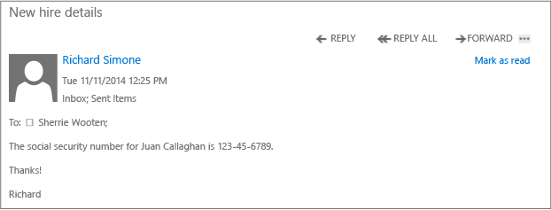

# Pełny ekran obrazu: Niechronione wiadomości e-mail (wewnętrzny)

Powrót do [Azure RMS w akcji: Automatycznie ochrona wiadomości e-mail z programu Exchange Online i zasady zapobiegania utraty danych](http://technet.microsoft.com/library/jj585026.aspx)

