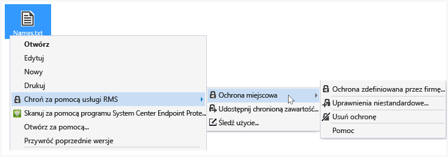

# Ochrona pliku na urządzeniu (Włącz ochronę miejscową) przy użyciu Rights Management udostępnianie aplikacji
Jeśli chroniony plik w miejscu, zastąpi on plik oryginalny, niechronione. Następnie można pozostawić pliku, gdzie jest, skopiuj je do innego folderu lub urządzenia lub udostępnianie folderu, który jest on i plik nadal będzie chroniony. Można również dołączyć chronionego pliku do wiadomości e-mail, mimo że jest zalecanym sposobem udostępniania chronionego pliku pocztą e-mail bezpośrednio za pomocą Eksploratora pliku lub aplikacji pakietu Office (zobacz [Ochrona pliku Udostępnij pocztą e-mail przy użyciu Rights Management udostępnianie aplikacji](../Topic/Protect_a_file_that_you_share_by_email_by_using_the_Rights_Management_sharing_application.md)).

> [!TIP]
> Jeśli wszystkie błędy podczas próby ochrony plików, zobacz [często zadawane pytania dotyczące Microsoft prawa udostępniania aplikacji dla systemu Windows do zarządzania](http://go.microsoft.com/fwlink/?LinkId=303971).

## Aby chronić pliku na urządzeniu (Włącz ochronę miejscową)

1.  Eksplorator plików wybierz plik do ochrony. Kliknij prawym przyciskiem myszy, wybierz opcję **Zabezpieczenia z usług RMS**, a następnie wybierz opcję **ochrony w miejscu**. Na przykład:

    

    > [!NOTE]
    > Jeśli nie widzisz **Zabezpieczenia z usług RMS** opcja, jest prawdopodobne, że RMS sharing aplikacji nie jest zainstalowany na komputerze, albo należy ponownie uruchomić komputer, aby ukończyć instalację. Aby uzyskać więcej informacji na temat sposobu zainstalowania RMS sharing aplikacji, zobacz [Pobierz i zainstaluj Rights Management udostępnianie aplikacji](../Topic/Download_and_install_the_Rights_Management_sharing_application.md).

2.  Wykonaj jedną z następujących czynności:

    -   Wybierz szablon zasady: Są to wstępnie zdefiniowane uprawnienia, które zazwyczaj ograniczenia dostępu i użytkowania do osób w Twojej organizacji. Na przykład, jeśli nazwa firmy jest "Contoso, Ltd.", może dojść **Contoso, Ltd. - tylko poufne widoku**. Jeśli jest to mieć chronionych plików na tym komputerze po raz pierwszy, zostanie najpierw musisz wybrać **Ochrona zdefiniowana przez firmę** do pobrania szablony.

        Przy następnym kliknięciu przycisku **ochrony w miejscu** opcji, pojawi się do 10 szablonów do wyboru. W przypadku więcej niż 10 dostępne szablony i żądany nie jest wyświetlane, kliknij przycisk **Ochrona zdefiniowana przez firmę** do pobrania i wyświetlić wszystkie szablony.

        Po wybraniu szablonu zasad można również chronić kilka plików i folderu. Po wybraniu folderu wszystkie pliki w tym folderze automatycznie zostały wybrane do ochrony, ale nowych plików tworzonych w tym folderze nie będą automatycznie chronione.

    -   Wybierz **uprawnienia niestandardowe**: Wybierz tę opcję, jeśli szablony nie zawierają poziom ochrony, należy lub ma zostać jawnie z opcji ochrony samodzielnie. Określ opcje dla tego pliku w [ochrony okno dialogowe dodawania](http://technet.microsoft.com/library/dn574738.aspx), a następnie kliknij przycisk **Zastosuj**.

3.  W oknie dialogowym można stwierdzić, czy plik jest chronione i okno zwraca do pliku Eksploratora szybko może dojść. Obecnie wybrany plik lub pliki są chronione. W niektórych przypadkach (podczas dodawania ochrony zmienia rozszerzenia nazwy pliku) oryginalny plik w Eksploratorze plik zostanie zastąpiony nowy plik zawierający ikonę blokady ochrony Rights Management. Na przykład:

    

Jeśli potrzebujesz później usunąć ochrony z pliku, zobacz [Usuwanie ochrony z pliku za pomocą Rights Management udostępnianie aplikacji](../Topic/Remove_protection_from_a_file_by_using_the_Rights_Management_sharing_application.md).

## Inne instrukcje i przykłady
Przykłady dla sposobu wykorzystania Rights Management udostępnianie aplikacji i instrukcje dotyczące wykonywania określonych zadań w następujących sekcjach z Podręcznik użytkownika aplikacji udostępniania Rights Management:

-   [Przykłady korzystania z aplikacji do udostępniania RMS](../Topic/Rights_Management_sharing_application_user_guide.md#BKMK_SharingExamples)

-   [Co chcesz zrobić?](../Topic/Rights_Management_sharing_application_user_guide.md#BKMK_SharingInstructions)

## Zobacz też
[Przewodnik użytkownika aplikacji udostępniania zarządzania prawami dostępu](../Topic/Rights_Management_sharing_application_user_guide.md)

