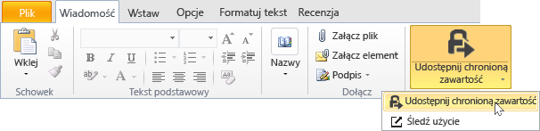
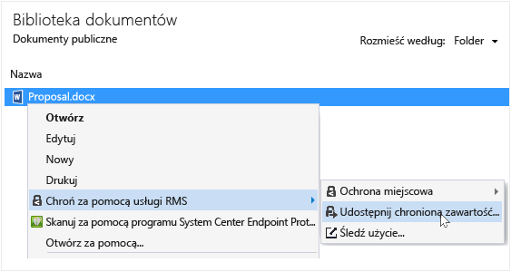
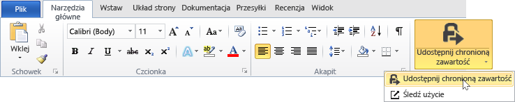
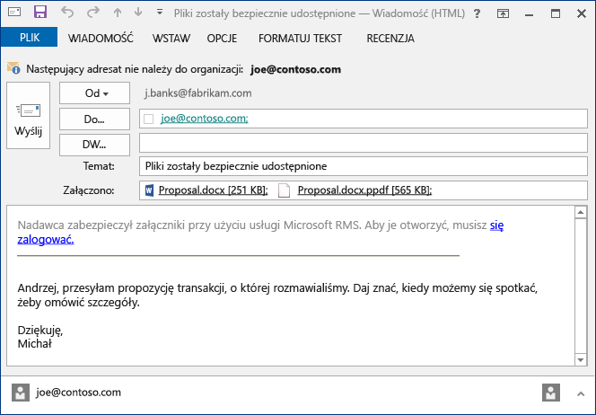

# Ochrona pliku Udostępnij pocztą e-mail przy użyciu Rights Management udostępnianie aplikacji
Jeśli chroniony plik, który Udostępnij pocztą e-mail, tworzy nową wersję oryginalnego pliku. Oryginalny plik pozostaje niechronione i nowa wersja jest chroniona i automatycznie dołączone do wiadomości e-mail, który następnie należy wysłać.

W niektórych przypadkach (w przypadku plików, które zostały utworzone przez program Microsoft Word, Excel i PowerPoint) RMS sharing aplikacji tworzy dwie wersje pliku, który dołącza do wiadomości e-mail. Druga wersja pliku ma **.ppdf** rozszerzenia nazwy pliku i jest kopii w tle PDF pliku. Ta wersja pliku powoduje, że odbiorców zawsze można odczytać pliku, nawet jeśli nie mają tej samej aplikacji zainstalowanych używaliśmy je utworzyć. Ma często miejsce w przypadku osób odczytać jego adresu e-mail na urządzeniach przenośnych i mają być wyświetlane ich załączników wiadomości e-mail. Do otwierania tego pliku, wystarczy im RMS sharing aplikacji. Następnie może odczytywać załączony plik, ale nie będzie mógł go zmienić, dopóki otwarciu wersję pliku za pomocą aplikacji, która obsługuje RMS.

Jeśli Twoja organizacja korzysta Azure RMS, użytkownik może zachować informacje o chroniących udostępnianie plików:

-   Wybierz opcję, aby otrzymywać wiadomości e-mail, gdy ktoś spróbuje otworzyć załączniki chronionym. Za każdym razem dostępu do pliku, użytkownik zostanie powiadomiony, który podjęto próbę otwarcia pliku i określa, czy i kiedy zostały one pomyślnie (zostali pomyślnie uwierzytelnieni) lub nie.

-   Korzystając z dokumentacji śledzenia witryny. Można nawet zatrzymać udostępnianie plików, poprzez odwołanie do niego dostępu w witrynie śledzenia dokumentu. Aby uzyskać więcej informacji, zobacz [Śledzenie i odwołać dokumentów, gdy użytkownik korzysta z RMS sharing aplikacji](../Topic/Track_and_revoke_your_documents_when_you_use_the_RMS_sharing_application.md).

## Korzystanie z programu Outlook: Aby chronić pliku Udostępnij pocztą e-mail

1.  Utwórz wiadomość e-mail i dołączyć plik. Następnie na **komunikat** kartę w **RMS** kliknij polecenie **Udostępnij chronione** a następnie kliknij przycisk **Udostępnij chronione** ponownie:

    

    Jeśli nie ma tego przycisku, istnieje duże prawdopodobieństwo, że RMS sharing aplikacji nie jest zainstalowany na komputerze, nie jest zainstalowana najnowsza wersja albo należy ponownie uruchomić komputer, aby ukończyć instalację. Aby uzyskać więcej informacji na temat sposobu zainstalowania udostępniania aplikacji, zobacz [Pobierz i zainstaluj Rights Management udostępnianie aplikacji](../Topic/Download_and_install_the_Rights_Management_sharing_application.md).

2.  Określ opcje dla tego pliku w [Udostępnianie chronionej okno dialogowe](http://technet.microsoft.com/library/dn574738.aspx), a następnie kliknij przycisk **Wyślij teraz**.

### Inne sposoby ochrony pliku Udostępnij pocztą e-mail
Oprócz udostępniania chronionego pliku za pomocą programu Outlook, możesz także użyć tych możliwości:

-   W Eksploratorze pliku: Ta metoda będzie działał dla wszystkich plików.

-   Z aplikacji pakietu Office: Ta metoda działa w aplikacji, które obsługuje RMS sharing aplikacji za pomocą dodatek Office, dzięki czemu możesz zobaczyć **RMS** grupę na Wstążce.

##### Za pomocą Eksploratora pliku lub aplikacji pakietu Office: Aby chronić pliku Udostępnij pocztą e-mail

1.  Użyj jednej z następujących czynności:

    -   Dla Eksploratora pliku: Kliknij prawym przyciskiem myszy plik, wybierz opcję **Zabezpieczenia z usług RMS**, a następnie wybierz opcję **Udostępnij chronione**:

        

    -   Dla pakietu Office aplikacji, Word, Excel i PowerPoint: Upewnij się, najpierw zapisać pliku. Następnie na **Strona główna** kartę w **RMS** kliknij polecenie **Udostępnij chronione** a następnie kliknij przycisk **Udostępnij chronione** ponownie:

        

    Jeśli nie ma te opcje ochrony, istnieje duże prawdopodobieństwo, że RMS sharing aplikacji nie jest zainstalowany na komputerze, nie jest zainstalowana najnowsza wersja albo należy ponownie uruchomić komputer, aby ukończyć instalację. Aby uzyskać więcej informacji na temat sposobu zainstalowania udostępniania aplikacji, zobacz [Pobierz i zainstaluj Rights Management udostępnianie aplikacji](../Topic/Download_and_install_the_Rights_Management_sharing_application.md).

2.  Określ opcje dla tego pliku w [Udostępnianie chronionej okno dialogowe](http://technet.microsoft.com/library/dn574738.aspx), a następnie kliknij przycisk **wysyłania**.

3.  W oknie dialogowym można stwierdzić, że plik jest on chroniony, a następnie możesz Zobacz wiadomości e-mail tworzona informująca adresatów, że załączniki są chronione przy użyciu Microsoft RMS i że ich musi się zarejestrować w szybkim może dojść. Po kliknięciu łącza do logowania, zobacz instrukcje i łącza, aby upewnić się, ich otworzyć chronionej załącznika.

    Przykład:

    

    Czy sprawdzić, możesz użyć: [Co to jest plik .ppdf, który jest tworzony automatycznie?](../Topic/Dialog_box_options_for_the_Rights_Management_sharing_application.md#BKMK_PPDF)

4.  Opcjonalne: Można zmienić żadnego elementu, który ma w tej wiadomości e-mail. Na przykład można dodać do lub zmienić temat lub tekst w komunikacie.

    > [!WARNING]
    > Chociaż można dodać lub usunąć użytkowników z tej wiadomości e-mail, nie zmienia uprawnienia dla określonej w parametrze załącznik **Udostępnij chronione** okno dialogowe. Jeśli chcesz zmienić uprawnienia, na przykład nadaj uprawnienia do otwierania tego pliku, Zamknij bez zapisywania i wysłaniem wiadomości e-mail nowej osoby i wróć do kroku 1.

5.  Wyślij wiadomość e-mail.

## Inne instrukcje i przykłady
Przykłady dla sposobu wykorzystania Rights Management udostępnianie aplikacji i instrukcje dotyczące wykonywania określonych zadań w następujących sekcjach z Podręcznik użytkownika aplikacji udostępniania Rights Management:

-   [Przykłady korzystania z aplikacji do udostępniania RMS](../Topic/Rights_Management_sharing_application_user_guide.md#BKMK_SharingExamples)

-   [Co chcesz zrobić?](../Topic/Rights_Management_sharing_application_user_guide.md#BKMK_SharingInstructions)

## Zobacz też
[Przewodnik użytkownika aplikacji udostępniania zarządzania prawami dostępu](../Topic/Rights_Management_sharing_application_user_guide.md)

