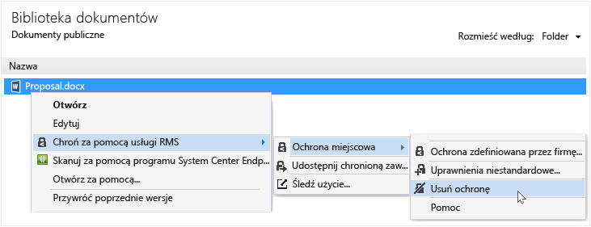

# Usuwanie ochrony z pliku za pomocą Rights Management udostępnianie aplikacji
Można usunąć ochrony z pliku (oznacza to, że nie Chroń plik) była wcześniej chroniona przy użyciu RMS sharing aplikacji, należy użyć **usunięcia ochrony** opcji z Eksploratora pliku.

> [!IMPORTANT]
> Musisz być właścicielem pliku do usunięcia ochrony.

### Aby usunąć ochrony z pliku

1.  W Eksploratorze plik, kliknij prawym przyciskiem myszy plik (na przykład Sample.ptxt), wybierz opcję **Zabezpieczenia z usług RMS**, kliknij przycisk **ochrony w miejscu**, a następnie kliknij przycisk **usunięcia ochrony**:

    

    Może zostać wyświetlony monit o poświadczenia.

Oryginalny plik chroniony jest usuwana (na przykład Sample.ptxt) i zastąpić plik o tej samej nazwie, ale z rozszerzeniem nazwy pliku niechronione (na przykład przykład.txt).

## Inne instrukcje i przykłady
Przykłady dla sposobu wykorzystania Rights Management udostępnianie aplikacji i instrukcje dotyczące wykonywania określonych zadań w następujących sekcjach z Podręcznik użytkownika aplikacji udostępniania Rights Management:

-   [Przykłady korzystania z aplikacji do udostępniania RMS](../Topic/Rights_Management_sharing_application_user_guide.md#BKMK_SharingExamples)

-   [Co chcesz zrobić?](../Topic/Rights_Management_sharing_application_user_guide.md#BKMK_SharingInstructions)

## Zobacz też
[Przewodnik użytkownika aplikacji udostępniania zarządzania prawami dostępu](../Topic/Rights_Management_sharing_application_user_guide.md)

