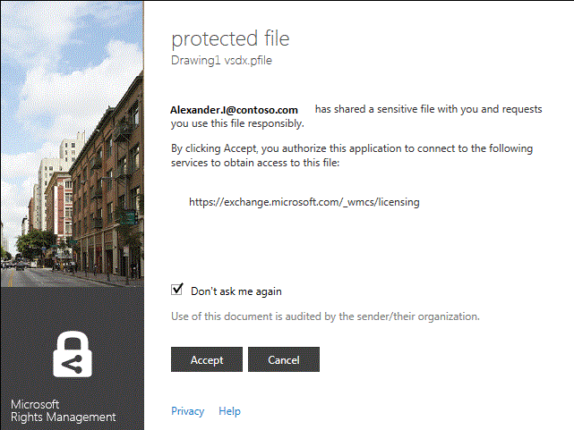
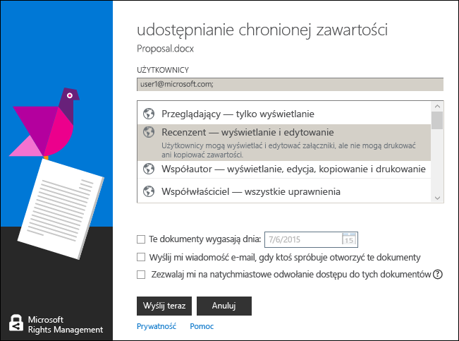

# Wersja 3., poprawiona: Przewodnik po aplikacji do tworzenia i przetwarzania dokument&#243;w chronionych usługami Microsoft Rights Management
Skorzystaj z tego przewodnika, aby za pomocą aplikacji do tworzenia i przetwarzania dokumentów chronionych usługami Microsoft Rights Management (RMS) dla systemu Windows zabezpieczać ważne dokumenty i obrazy przed niepowołanymi osobami nawet po przesłaniu tych plików pocztą e-mail lub zapisaniu na innym urządzeniu. Ta aplikacja umożliwia także otwieranie i używanie plików chronionych przez inne osoby za pomocą tej samej technologii Rights Management.

Ta aplikacja do udostępniania umożliwia ochronę plików w następujące sposoby:

-   Dodaje nowe funkcje do Eksploratora plików (w systemie Windows 7 i starszych wersjach znanego jako Eksplorator Windows), dzięki czemu podczas zarządzania plikami w folderze można łatwo włączyć ochronę jednego pliku, wielu plików jednocześnie lub wszystkich plików w folderze.

-   Zapewnia ochronę wszystkich typów plików i ma wbudowaną przeglądarkę najpopularniejszych typów plików tekstowych i obrazów.

-   Powoduje dodanie przycisku **Udostępnij chronione** do paska narzędzi pakietu Microsoft Office w programie Word, PowerPoint i Excel.

Wystarczy mieć komputer z systemem Windows 7 lub Windows 8 oraz uprawnienia administratora lokalnego, dzięki którym można zainstalować aplikację RMS sharing. Następnie można już pobrać i zainstalować tę bezpłatną aplikację firmy Microsoft.

Jeśli masz pytania, na które nie odpowiedziano w tym przewodniku, zobacz [Często zadawane pytania dotyczące aplikacji do tworzenia i przetwarzania dokumentów chronionych usługami Microsoft Rights Management dla systemu Windows](http://go.microsoft.com/fwlink/?LinkId=303971).

## Przykłady korzystania z aplikacji RMS sharing
Poniżej przedstawiono kilka sposobów ochrony plików za pomocą aplikacji RMS sharing.

|Scenariusz|Rozwiązanie z wykorzystaniem aplikacji RMS sharing|
|--------------|------------------------------------------------------|
|**Bezpieczne kopiowanie poufnych dokumentów firmowych na inne urządzenie**<br /><br />Pracujesz na komputerze nad strategicznym dokumentem o charakterze poufnym. Chcesz skopiować dokument na przenośny dysk USB, aby pracować nad nim po wyjściu z biura, bez dostępu do sieci firmowej.|Zarówno na komputerze stacjonarnym, jak i na laptopie masz zainstalowaną aplikację RMS sharing. Na komputerze korzystasz z Eksploratora plików do ochrony pliku za pomocą szablonu, aby nie mogły z niego korzystać osoby spoza firmy. Następnie kopiujesz plik na dysk przenośny, podłączasz ten dysk do laptopa i dalej pracujesz nad dokumentem. Jeśli zgubisz dysk lub laptop zostanie skradziony, nikt spoza firmy nie uzyska dostępu do tego dokumentu.|
|**Bezpieczne udostępnianie informacji finansowych komuś zaufanemu spoza organizacji**<br /><br />Chcesz przesłać pocztą e-mail firmie, z którą współpracujesz, arkusz kalkulacyjny programu Excel zawierający prognozy finansowe. Chcesz, aby mogli oni wyświetlić dane bez możliwości ich edycji.|Użyj przycisku **Udostępnij chronione** na wstążce w programie Excel, wpisz adresy e-mail adresatów z partnerskiej firmy, wybierz na suwaku ustawienie **Przeglądanie** i kliknij przycisk **Wyślij**.<br /><br />Kiedy wiadomość e-mail dotrze do partnerskiej firmy, załączony arkusz będą mogli otworzyć tylko adresaci wiadomości (bez możliwości zapisywania, edytowania, drukowania ani przekazywania dalej).|
|**Bezpieczne wysłanie diagramu inżynieryjnego pocztą e-mail do osoby korzystającej z urządzenia z systemem iOS**<br /><br />Twoja firma korzysta z własnej aplikacji inżynieryjnej. Chcesz wysłać pocztą e-mail poufny diagram do współpracownika, który często sprawdza pocztę na swoim urządzeniu z systemem iOS.|W Eksploratorze plików kliknij plik prawym przyciskiem myszy, a następnie wybierz polecenie **Udostępnij chronione**. Aplikacja RMS sharing rozpoznaje, że rozszerzenie nazwy pliku nie pochodzi z aplikacji, która natywnie obsługuje usługi RMS, więc po dołączeniu pliku do wiadomości e-mail automatycznie konwertuje go na plik chroniony ogólnie i wybiera opcję **Zezwalaj na użycie na wszystkich urządzeniach**.<br /><br />Adresat odbierze wiadomość e-mail na urządzaniu z systemem iOS, kliknie link w wiadomości e-mail, z którego dowie się, jak pobrać aplikację RMS sharing, zainstaluje wersję aplikacji przeznaczoną na urządzenia z systemem iOS, po czym będzie mógł wyświetlić diagram.|
|**Moja firma nie korzysta z usług Rights Management, ale mam odebraną wiadomość e-mail z załącznikiem chronionym za pomocą usług RMS**<br /><br />Nadawcą wiadomości e-mail jest zaufana osoba (kiedyś współpracowaliście). Podejrzewasz, że mogła Ci wysłać informacje dotyczące nowych możliwości biznesowych.|Klikasz link w wiadomości e-mail, aby uzyskać informacje o sposobie pobrania aplikacji RMS sharing na Twój komputer, zainstalowania jej i założenia konta usług RMS dla osób indywidualnych. Firma Microsoft potwierdza, że Twoja organizacja nie ma subskrypcji pakietu Office 365, wysyła Ci wiadomość e-mail umożliwiającą ukończenie procesu zakładania konta, po czym możesz się już do niego zalogować. Następnie możesz otworzyć załącznik wiadomości e-mail i zapoznać się z informacjami o nowych możliwościach biznesowych.|

## <a name="BKMK_Install"></a>Jak pobrać i zainstalować aplikację RMS sharing
> [!IMPORTANT]
> Aby zainstalować aplikację RMS sharing, musisz mieć konto administratora lokalnego. Jeśli nie zalogujesz się jako administrator lokalny, możesz skorzystać z opcji **Uruchom jako administrator** podczas uruchamiania pliku Setup.exe w kroku 3.

Aby zainstalować aplikację RMS sharing, wykonaj poniższe czynności:

1.  Przejdź do strony [Microsoft Rights Management](http://go.microsoft.com/fwlink/?LinkId=303970) w witrynie internetowej firmy Microsoft.

2.  W sekcji **Komputery** kliknij ikonę **aplikacji RMS dla systemu Windows** i zapisz pakiet instalacyjny aplikacji do tworzenia i przetwarzania dokumentów chronionych usługami Microsoft Rights Management na swoim komputerze.

3.  Kliknij dwukrotnie pobrany skompresowany plik, a następnie kliknij dwukrotnie plik **setup.exe**. Jeśli zostanie wyświetlony monit o kontynuowanie, kliknij pozycję **Tak**.

4.  Na stronie **Instalowanie usług Microsoft RMS** kliknij przycisk **Dalej** i poczekaj na zakończenie instalacji.

5.  Po zakończeniu instalacji kliknij pozycję **Uruchom ponownie**, aby ponownie uruchomić komputer i ukończyć instalację. Możesz również kliknąć pozycję **Zamknij** i uruchomić komputer ponownie później, aby ukończyć instalację.

Teraz możesz już chronić swoje pliki i otwierać pliki chronione udostępnione przez innych.

## <a name="BKMK_UsingMSRMSApp"></a>Co chcesz zrobić?
Poniższe instrukcje pomagają w pracy z chronionymi plikami.

### <a name="BKMK_CreatePTXT"></a>Tworzenie chronionego pliku tekstowego
Zwykły plik tekstowy (txt) można przekonwertować na plik chroniony mający rozszerzenie ptxt.

##### Aby utworzyć chroniony plik tekstowy (ptxt)

1.  W Eksploratorze plików kliknij prawym przyciskiem myszy wewnątrz folderu, kliknij pozycję **Nowy**, a następnie kliknij pozycję **Dokument tekstowy**.

2.  Zmień nazwę pliku (np.: Przykład.txt).

3.  Kliknij dwukrotnie plik, aby otworzyć go w Notatniku.

4.  W Notatniku dodaj kilka wierszy tekstu do pliku, a następnie zapisz ten plik. Poniższy tekst może posłużyć za przykład.

    ```
    This is a sample text file.
    This is a sample text file.
    This is a sample text file.
    This is a sample text file. 
    This is a sample text file.
    This is a sample text file.
    ```

5.  Kliknij plik prawym przyciskiem myszy, kliknij pozycję **Włącz ochronę miejscową**, a następnie wybierz szablon z listy. Jeśli po raz pierwszy używasz aplikacji RMS sharing, musisz najpierw wybrać pozycję **Firma — Ochrona**, co spowoduje pobranie szablonów dla Twojej organizacji.

6.  Na ekranie **Aplikacja do tworzenia i przetwarzania dokumentów chronionych usługami Microsoft Rights Management** potwierdź zasady, które chcesz zastosować, a następnie kliknij pozycję **Zastosuj**, a po włączeniu ochrony pliku kliknij pozycję **Zamknij**.

### <a name="BKMK_ViewPTXT"></a>Wyświetlanie chronionego pliku tekstowego (ptxt) lub chronionego pliku obrazu
Aby wyświetlić chroniony plik tekstowy (ptxt), kliknij dwukrotnie ten plik (np. Przykład.ptxt) w Eksploratorze plików. Może zostać wyświetlony monit o podanie poświadczeń. Kiedy plik zostanie otwarty, u góry pliku będą wyświetlone zasady ochrony tego pliku.

Obrazy chronione wyświetla i otwiera się w ten sam sposób.

### <a name="BKMK_CreatePFILE"></a>Tworzenie pliku chronionego ogólnie
Format pliku chronionego ogólnie (pfile) może być stosowany w celu zapewniania ogólnego poziomu ochrony dla plików o typach, które nie są bezpośrednio obsługiwane przez aplikację RMS sharing lub inne aplikacje z wbudowaną ochroną typu RMS. Za pomocą strony [Microsoft Rights Management](http://go.microsoft.com/fwlink/?LinkId=303970) w witrynie internetowej firmy Microsoft można szybko sprawdzić, które aplikacje obsługują ochronę wbudowaną usługami RMS.

Na przykład program Microsoft Visio nie obsługuje obecnie wbudowanej ochrony usług RMS, a zatem do ochrony plików vsd utworzonych w programie Microsoft Visio należy użyć ochrony ogólnej.

> [!TIP]
> Czym się różnią ochrona wbudowana (natywna) i ochrona ogólna?
> 
> -   Jeśli plik jest objęty ochroną ogólną, nieupoważnione osoby nie mogą otworzyć tego pliku. Upoważniona osoba może jednak po otwarciu pliku przesłać go bez ochrony do innych osób albo zapisać w miejscu dostępnym dla innych. U góry pliku jest jednak wyświetlany komunikat informujący o posiadanych przez nią uprawnieniach oraz prośba o ich respektowanie, ale ochrona nie jest wymuszana. Ponadto w przypadku ochrony ogólnej pliku nie można wyznaczyć uprawnień bardziej ograniczonych niż autoryzacja. Na przykład w przypadku używania uprawnień niestandardowych suwak w aplikacji RMS sharing zostaje automatycznie ustawiony na pozycji **WSPÓŁWŁAŚCICIEL** i nie można zmienić tego na bardziej restrykcyjne uprawnienia, takie jak **PRZEGLĄDANIE** lub **WSPÓŁAUTOR**.
> -   Natomiast ochrona wbudowana dostępna w ramach usług RMS dla obsługujących ją aplikacji (np. plików pakietu Office) obowiązuje, nawet jeśli chroniony plik zostanie przesłany innej osobie lub zapisany w innym miejscu. Ochrona takich plików umożliwia stosowanie restrykcyjnych uprawnień (np. tylko odczyt) lub uprawnień do edycji (ale nie do drukowania lub kopiowania). Jeśli na przykład korzystasz z uprawnień niestandardowych, suwak w aplikacji RMS sharing zostaje automatycznie ustawiony na pozycji **RECENZENT**. Ustawienie to można później zmienić na bardziej lub mniej restrykcyjne uprawnienia.

##### Przykład: Aby utworzyć plik chroniony ogólnie (pfile) z pliku rysunku programu Visio (vsd)

1.  W Eksploratorze plików kliknij prawym przyciskiem myszy wewnątrz folderu, kliknij pozycję **Nowy**, a następnie kliknij pozycję **Nowy dokument programu Visio**.

2.  Zmień nazwę pliku (np. Przykład.vsd).

3.  Kliknij dwukrotnie plik, aby otworzyć go w programie Visio.

4.  W programie Visio dodaj elementy do rysunku, a następnie zapisz i zamknij plik.

5.  Kliknij plik prawym przyciskiem myszy, kliknij pozycję **Włącz ochronę miejscową**, a następnie wybierz szablon zasad z listy. Jeśli po raz pierwszy używasz aplikacji RMS sharing, musisz najpierw wybrać pozycję **Firma — Ochrona**, co spowoduje pobranie szablonów dla Twojej organizacji.

6.  Na ekranie **Aplikacja do tworzenia i przetwarzania dokumentów chronionych usługami Microsoft Rights Management** wybierz zasadę, którą chcesz zastosować, a następnie kliknij pozycję **Zastosuj**.

7.  Zostanie wyświetlony komunikat z informacją, że plik chroniony został zapisany jako plik pfile (np. Przykład.vsd.pfile). Oryginalny plik zostaje usunięty.

### <a name="BKMK_ViewPFILE"></a>Wyświetlanie pliku chronionego ogólnie (pfile)
Aby wyświetlić plik chroniony ogólnie (pfile), kliknij dwukrotnie ten plik (np. plik Przykład.vsd.pfile) w Eksploratorze plików, a następnie kliknij pozycję **Otwórz**.

### <a name="BKMK_Unprotect"></a>Usuwanie ochrony z pliku
Aby usunąć ochronę z pliku, który był wcześniej chroniony, skorzystaj z opcji **Usuń ochronę**:

1.  Kliknij prawym przyciskiem myszy plik (np. Przykład.ptxt), kliknij pozycję **Włącz ochronę miejscową**, a następnie kliknij pozycję **Usuń ochronę**: Może zostać wyświetlony monit o podanie poświadczeń.

2.  Oryginalny chroniony plik zostaje usunięty (np. Przykład.ptxt) i zastąpiony plikiem o takiej samej nazwie, ale z rozszerzeniem nazwy pliku niechronionego (np. Przykład.txt).

### <a name="BKMK_ProtectCustom"></a>Ochrona pliku przy użyciu własnych uprawnień niestandardowych
Najprostszą metodą ochrony pliku jest użycie szablonów i określenie własnych uprawnień. Ta metoda jest określana mianem ochrony autorskiej użytkownika i przydaje się do:

-   ograniczania dostępu do plików tylko do określonej listy użytkowników identyfikowanych na podstawie ich adresów e-mail;

-   ograniczenia używania pliku tylko do określonych praw, takich jak prawo tylko do odczytu do dokumentu.

Aby chronić plik z uprawnieniami utworzonymi przez użytkownika, kliknij plik prawym przyciskiem myszy, kliknij pozycję **Włącz ochronę miejscową** i kliknij przycisk **Uprawnienia niestandardowe**. Zostanie wyświetlony następujący ekran:


Wprowadź adresy e-mail użytkowników, wybierz uprawnienia do pliku za pomocą suwaka, a następnie kliknij przycisk **Zastosuj**.

### <a name="BKMK_UserDefined"></a>Używanie plików objętych ochroną niestandardową
Większość plików chronionych, które będziesz otwierać, będzie chroniona za pomocą szablonów. Użytkownicy mogą jednak także chronić pliki za pomocą własnych uprawnień niestandardowych, co jest nazywane ochroną autorską użytkownika.

W przypadku formatów plików obrazów i plików tekstowych ten poziom ochrony wymaga, aby wszelkie aplikacje używane do edycji, zapisywania i ograniczania tych plików zostały zaprojektowane z myślą o obsłudze ochrony za pomocą usług RMS oraz miały zaimplementowane interfejsy API ochrony udostępnione w zestawie SDK usług AD RMS.

Podczas wyświetlania chronionego pliku tekstowego objętego ochroną autorską użytkownika zauważysz niewielką różnicę w sposobie wyświetlania uprawnień dla pliku, co pokazano na poniższym przykładzie.

W przypadku plików chronionych przy użyciu formatu pliku ochrony ogólnej (pfile) określone prawa lub uprawnienia określone przez użytkownika zostaną wyświetlone na ekranie potwierdzenia zamiast nazwy szablonu użytego do ochrony pliku, co zostało pokazane na poniższej ilustracji.



### <a name="BKMK_ShareProtected"></a>Ochrona zawartości udostępnianej pocztą e-mail
Aby chronić zawartość, która ma zostać udostępniona za pomocą wiadomości e-mail, kliknij plik prawym przyciskiem myszy, a następnie kliknij polecenie **Udostępnij chronione**. Zostanie wyświetlony następujący ekran:


Wprowadź adresy e-mail użytkowników z listy, wybierz uprawnienia do pliku za pomocą suwaka, a następnie kliknij przycisk **Wyślij**. Program Outlook utworzy wiadomość e-mail dla wybranych adresatów z krótkim tekstem, który można zmienić, i dołączy do niej chroniony plik. Oryginalny plik nie podlega ochronie.

Aby umożliwić użytkownikom wyświetlanie chronionych plików na urządzeniach z systemem innym niż Windows, kliknij pozycję **Zezwalaj na użycie na wszystkich urządzeniach**. Może być konieczne pobranie przez użytkowników aplikacji RMS sharing dla ich urządzeń. Link, który to umożliwia, jest zawarty w wiadomości e-mail.

### <a name="BKMK_Multiple"></a>Stosowanie ochrony do wielu plików i folderów
W przypadku używania Eksploratora plików nie trzeba stosować ochrony do pojedynczych plików. Zamiast tego można wybrać wiele plików lub wszystkie pliki w folderze (o ile nie są one jeszcze chronione).

##### Aby chronić kilka plików lub wszystkie pliki w wybranym folderze

1.  W Eksploratorze plików wybierz wiele plików lub wybierz folder zawierający pliki, które mają być chronione.

2.  Kliknij wybrany folder lub wybrane pliki prawym przyciskiem myszy, kliknij pozycję **Włącz ochronę miejscową**, a następnie wybierz szablon z listy. Jeśli po raz pierwszy używasz aplikacji RMS sharing, musisz najpierw wybrać pozycję **Firma — Ochrona**, co spowoduje pobranie szablonów dla Twojej organizacji.

3.  Na ekranie **Aplikacja do tworzenia i przetwarzania dokumentów chronionych usługami Microsoft Rights Management** sprawdź, czy pliki zostały poddane ochronie.

> [!TIP]
> W przypadku błędów zobacz [Często zadawane pytania dotyczące aplikacji do tworzenia i przetwarzania dokumentów chronionych usługami Microsoft Rights Management dla systemu Windows](http://go.microsoft.com/fwlink/?LinkId=303971).

### <a name="BKMK_OfficeToolbar"></a>Używanie dodatku dla paska narzędzi pakietu Office
Możesz chronić i udostępniać pliki programu Word, PowerPoint i Excel bezpośrednio z pakietu Microsoft Office, używając dodatku aplikacji do tworzenia i przetwarzania dokumentów chronionych usługami Microsoft Rights Management dla wstążki pakietu Office.

W grupie **Ochrona** kliknij pozycję **Udostępnij chronione**, aby uruchomić aplikację do tworzenia i przetwarzania dokumentów chronionych usługami Microsoft Rights Management.


### <a name="BKMK_AccessKeys"></a>Używanie skrótów klawiaturowych
Naciśnij klawisz **Alt** w celu wyświetlenia klawiszy dostępu, a następnie naciśnij klawisze **Alt**+klawisz dostępu w celu wybrania opcji.

Na przykład w oknie dialogowym **Udostępnianie chronionej zawartości** naciśnij klawisz **Alt** w celu wyświetlenia klawiszy dostępu, a następnie naciśnij klawisze **Alt+u** w celu zaznaczenia pola wyboru **Użytkownicy będą musieli się zalogować przy każdym otwarciu tego pliku**.



## Zobacz też
[Pobieranie aplikacji do tworzenia i przetwarzania dokumentów chronionych usługami Microsoft Rights Management](http://go.microsoft.com/fwlink/?LinkId=303970)
 [Często zadawane pytania dotyczące aplikacji do tworzenia i przetwarzania dokumentów chronionych usługami Microsoft Rights Management dla systemu Windows](http://go.microsoft.com/fwlink/?LinkId=303971)

