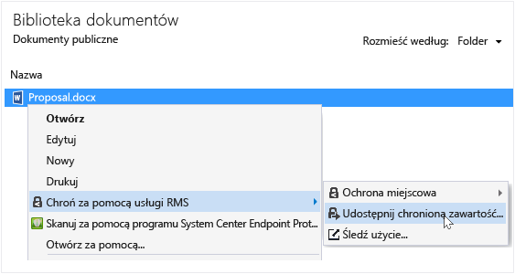

# Przewodnik użytkownika aplikacji do tworzenia i przetwarzania dokument&#243;w chronionych usługami Rights Management — poprawki dotyczące jednego tematu
Aplikacja do tworzenia i przetwarzania dokumentów chronionych usługami Microsoft Rights Management (aplikacja RMS sharing) dla systemu Windows pomaga zabezpieczyć ważne dokumenty i obrazy przed niepowołanymi osobami nawet po przesłaniu tych plików pocztą e-mail lub zapisaniu na innym urządzeniu. Za pomocą tej aplikacji można też otwierać pliki chronione przez innych za pomocą tej samej technologii (Rights Management).

Wystarczy mieć komputer obsługujący system Windows 7 lub nowszy oraz uprawnienia administratora lokalnego, dzięki którym można zainstalować aplikację RMS sharing. Następnie można już [pobrać i zainstalować](http://go.microsoft.com/fwlink/?LinkId=303970) tę bezpłatną aplikację firmy Microsoft.

Jeśli masz pytania, na które nie odpowiedziano w tym przewodniku, zobacz [Często zadawane pytania dotyczące aplikacji do tworzenia i przetwarzania dokumentów chronionych usługami Microsoft Rights Management dla systemu Windows](http://go.microsoft.com/fwlink/?LinkId=303971).

Poniżej przedstawiono kilka sposobów ochrony plików za pomocą aplikacji do udostępniania.

|Cel|Metoda|
|-------|----------|
|**Bezpieczne udostępnianie informacji finansowych komuś zaufanemu spoza swojej organizacji**  Chcesz przesłać pocztą e-mail firmie, z którą współpracujesz, arkusz kalkulacyjny programu Excel zawierający prognozy finansowe. Chcesz, aby mogli oni wyświetlić dane bez możliwości ich edycji.|Użyj przycisku Udostępnij chronione na wstążce w programie Excel, wpisz adresy e-mail adresatów z partnerskiej firmy, wybierz na suwaku ustawienie Przeglądanie i kliknij przycisk Wyślij.  Kiedy wiadomość e-mail dotrze do partnerskiej firmy, załączony arkusz będą mogli otworzyć tylko adresaci wiadomości (bez możliwości zapisywania, edytowania, drukowania ani przekazywania dalej).  Szczegóły: Zobacz **Ochrona pliku udostępnionego pocztą e-mail** w sekcji [What do you want to do?](../Topic/Rights_Management_sharing_application_user_guide_-_revision_for_single_topic.md#BKMK_UsingMSRMSApp) w tym przewodniku.|
|**Bezpieczne wysłanie dokumentu pocztą e-mail do osoby korzystającej z urządzenia z systemem iOS**  Chcesz wysłać pocztą e-mail poufny dokument programu Word do współpracownika, który często sprawdza pocztę na swoim urządzeniu z systemem iOS.|W Eksploratorze plików kliknij plik prawym przyciskiem myszy, a następnie wybierz polecenie Udostępnij chronione. W aplikacji RMS sharing wybierz opcję Zezwalaj na użycie na wszystkich urządzeniach i wyślij współpracownikowi plik jako załącznik.  Adresat odbierze wiadomość e-mail na urządzaniu z systemem iOS, kliknie link w wiadomości e-mail, z którego dowie się, jak pobrać aplikację do udostępniania, zainstaluje wersję aplikacji przeznaczoną na urządzenia z systemem iOS, po czym będzie mógł wyświetlić dokument.  Szczegóły: Zobacz **Ochrona pliku udostępnionego pocztą e-mail** w sekcji [What do you want to do?](../Topic/Rights_Management_sharing_application_user_guide_-_revision_for_single_topic.md#BKMK_UsingMSRMSApp) w tym przewodniku.|
|**Otwarcie chronionego załącznika otrzymanego w wiadomości e-mail w firmie, która nie korzysta z usługi Rights Management**  Nadawcą wiadomości e-mail jest zaufana osoba (kiedyś współpracowaliście). Podejrzewasz, że mogła Ci wysłać informacje dotyczące nowych możliwości biznesowych.|Postępujesz zgodnie z instrukcjami w wiadomości e-mail i klikasz link, aby założyć konto w usłudze Microsoft Rights Management. Firma Microsoft potwierdza, że Twoja organizacja nie ma subskrypcji pakietu Office 365, wysyła Ci wiadomość e-mail umożliwiającą ukończenie procesu zakładania konta, po czym możesz się już do niego zalogować. Klikasz drugi link znajdujący się w wiadomości e-mail, który umożliwia zainstalowanie aplikacji do tworzenia i przetwarzania dokumentów chronionych usługami Rights Management. Po ukończeniu instalacji możesz już otworzyć załącznik i przeczytać o nowych możliwościach biznesowych.  Szczegóły: Zobacz **Wyświetlanie i używanie plików chronionych przez usługę Rights Management** w sekcji [What do you want to do?](../Topic/Rights_Management_sharing_application_user_guide_-_revision_for_single_topic.md#BKMK_UsingMSRMSApp) w tym przewodniku.|
|**Ochrona poufnych danych firmy na laptopie przed osobami spoza firmy**  Często podróżujesz, co wymaga używania laptopa do obsługi plików w folderze, który musi być zabezpieczony przed nieautoryzowanymi osobami.|Na laptopie masz zainstalowaną aplikację RMS sharing. Korzystając z Eksploratora plików, chronisz pliki za pomocą szablonu służącego do szybkiego zabezpieczania plików. W przypadku kradzieży laptopa nikt spoza firmy nie będzie mógł uzyskać dostępu do tych dokumentów.  Szczegóły: Zobacz **Ochrona pliku na urządzeniu (ochrona miejscowa)** w sekcji [What do you want to do?](../Topic/Rights_Management_sharing_application_user_guide_-_revision_for_single_topic.md#BKMK_UsingMSRMSApp) w tym przewodniku.|

## Co chcesz zrobić?
Poniższe instrukcje pomagają w pracy z chronionymi plikami.

### Pobieranie i instalowanie aplikacji do tworzenia i przetwarzania dokumentów chronionych usługami Rights Management

1.  Przejdź do strony [Microsoft Rights Management](http://go.microsoft.com/fwlink/?LinkId=303970) w witrynie internetowej firmy Microsoft.

2.  W sekcji **Komputery** kliknij ikonę **aplikacji RMS dla systemu Windows** i zapisz pakiet instalacyjny aplikacji do tworzenia i przetwarzania dokumentów chronionych usługami Microsoft Rights Management na swoim komputerze.

3.  Kliknij dwukrotnie pobrany skompresowany plik, a następnie kliknij dwukrotnie plik **setup.exe**. Jeśli zostanie wyświetlony monit o kontynuowanie, kliknij pozycję **Tak**.

    > [!TIP]
    > Może być konieczne przewinięcie listy w dół w bieżącym folderze, aby zobaczyć plik **setup.exe**.

4.  Na stronie **Instalowanie usług Microsoft RMS** kliknij przycisk **Dalej** i poczekaj na zakończenie instalacji.

5.  Po zakończeniu instalacji kliknij pozycję **Uruchom ponownie**, aby ponownie uruchomić komputer i ukończyć instalację. Możesz również kliknąć pozycję **Zamknij** i uruchomić komputer ponownie później, aby ukończyć instalację.

Teraz możesz już chronić swoje pliki i otwierać pliki chronione udostępnione przez innych.

#### Więcej informacji
Aby zainstalować aplikację do udostępniania, musisz mieć konto administratora lokalnego. Jeśli nie zalogujesz się jako administrator lokalny, możesz skorzystać z opcji **Uruchom jako administrator** podczas uruchamiania pliku Setup.exe w kroku 3.

### Ochrona pliku na urządzeniu (ochrona miejscowa)

1.  W Eksploratorze plików wybierz plik, folder lub wiele plików do ochrony. Kliknij prawym przyciskiem myszy, a następnie wybierz opcję **Włącz ochronę miejscową**. Przykład:

    

    > [!NOTE]
    > Jeśli opcja **Włącz ochronę miejscową** nie jest widoczna, może to znaczyć, że aplikacja do udostępniania nie jest zainstalowana na danym komputerze albo trzeba ponownie uruchomić komputer w celu ukończenia instalacji. Aby uzyskać więcej informacji o sposobie instalowania aplikacji do udostępniania, zobacz instrukcje **Pobieranie i instalowanie aplikacji do tworzenia i przetwarzania dokumentów chronionych usługami Rights Management** w sekcji [What do you want to do?](../Topic/Rights_Management_sharing_application_user_guide_-_revision_for_single_topic.md#BKMK_UsingMSRMSApp) w tym przewodniku.

2.  Wykonaj jedną z następujących czynności:

    -   Wybierz szablon zasad: Są to wstępnie zdefiniowane uprawnienia, które ograniczają dostęp i możliwość używania do osób w danej organizacji. Jeśli po raz pierwszy masz plik chroniony na tym komputerze, najpierw musisz wybrać pozycję **Ochrona zdefiniowana przez firmę** w celu pobrania szablonów. Nazwy szablonów zaczynają się od nazwy danej firmy, za którą następuje nazwa opisowa danego uprawnienia. Przykład: **Contoso — tylko wgląd poufny**

    -   Wybierz pozycję **Uprawnienia niestandardowe**: Wybierz tę opcję, jeśli szablony nie zapewniają odpowiedniego poziomu ochrony. Możesz ją wybrać na przykład, jeśli chcesz dać dostęp osobom spoza organizacji lub samodzielnie ustawić opcje ochrony. Określ opcje dla tego pliku w oknie dialogowym **Dodawanie ochrony** i kliknij pozycję **Zastosuj**.

        > [!NOTE]
        > Aby uzyskać więcej informacji na temat opcji w tym oknie dialogowym, zobacz instrukcje **Określanie opcji w oknie dialogowym Rights Management** w sekcji [What do you want to do?](../Topic/Rights_Management_sharing_application_user_guide_-_revision_for_single_topic.md#BKMK_UsingMSRMSApp) w tym przewodniku.

3.  Przez chwilę może być wyświetlane okno dialogowe informujące, że plik jest chroniony, po czym nastąpi powrót do Eksploratora plików. Wybrany plik lub pliki są teraz chronione. W niektórych przypadkach (kiedy dodanie ochrony powoduje zmianę rozszerzenia nazwy pliku) oryginalny plik znajdujący się w Eksploratorze plików zostaje zastąpiony nowym plikiem oznaczonym ikoną kłódki sygnalizującą ochronę za pomocą usług Rights Management. Przykład:

    

Jeśli zechcesz później usunąć ochronę z pliku, zobacz **Usuwanie ochrony z pliku** w sekcji [What do you want to do?](../Topic/Rights_Management_sharing_application_user_guide_-_revision_for_single_topic.md#BKMK_UsingMSRMSApp) w tym przewodniku.

#### Więcej informacji
Miejscowa ochrona pliku polega na zastąpieniu nim oryginalnego pliku, który nie jest chroniony. Następnie można pozostawić plik w jego obecnej lokalizacji, skopiować do innego folderu lub na inne urządzenie albo udostępnić folder zawierający plik — a plik cały czas będzie chroniony. Chroniony plik można także dołączyć do wiadomości e-mail, chociaż zalecaną metodą udostępniania pliku chronionego pocztą e-mail jest bezpośrednie dołączenie go z poziomu Eksploratora plików lub aplikacji pakietu Office (zobacz **Ochrona pliku udostępnionego pocztą e-mail** w sekcji [What do you want to do?](../Topic/Rights_Management_sharing_application_user_guide_-_revision_for_single_topic.md#BKMK_UsingMSRMSApp) w tym przewodniku).

Tę samą metodę można wykorzystać do ochrony wielu plików jednocześnie lub do ochrony folderu. W przypadku ochrony folderu chronione są wszystkie znajdujące się w nim pliki, ale nowe pliki w nim tworzone nie są już automatycznie chronione.

Jeśli podczas próby włączenia ochrony plików są wyświetlane błędy, zajrzyj do artykułu [Często zadawane pytania dotyczące aplikacji do tworzenia i przetwarzania dokumentów chronionych usługami Microsoft Rights Management dla systemu Windows](http://go.microsoft.com/fwlink/?LinkId=303971).

### Ochrona pliku udostępnionego pocztą e-mail

1.  Skorzystaj z jednej z następujących opcji:

    -   W przypadku Eksploratora plików: Kliknij plik prawym przyciskiem myszy i wybierz pozycję **Udostępnij chronione**:

        

    -   W przypadku aplikacji pakietu Office: Najpierw upewnij się, że plik został zapisany. Następnie w grupie **Protection** kliknij pozycję **Udostępnij chronione**.

        

    > [!NOTE]
    > Jeśli opcje ochrony udostępnianej zawartości nie są wyświetlone, możliwe, że aplikacja do udostępniania nie jest zainstalowana na danym komputerze albo trzeba ponownie uruchomić komputer w celu ukończenia instalacji. Aby uzyskać więcej informacji o sposobie instalowania aplikacji do udostępniania, zobacz instrukcje **Pobieranie i instalowanie aplikacji do tworzenia i przetwarzania dokumentów chronionych usługami Rights Management** w sekcji [What do you want to do?](../Topic/Rights_Management_sharing_application_user_guide_-_revision_for_single_topic.md#BKMK_UsingMSRMSApp) w tym przewodniku.

2.  Określ opcje dla tego pliku w oknie dialogowym **Udostępnianie chronionej zawartości** i kliknij pozycję **Wyślij**.

    

    > [!NOTE]
    > Aby uzyskać więcej informacji na temat opcji w tym oknie dialogowym, zobacz instrukcje **Określanie opcji w oknie dialogowym Rights Management** w sekcji [What do you want to do?](../Topic/Rights_Management_sharing_application_user_guide_-_revision_for_single_topic.md#BKMK_UsingMSRMSApp) w tym przewodniku.

3.  Przez chwilę może być wyświetlane okno dialogowe informujące o tym, że plik jest chroniony, po czym pojawi się wiadomość e-mail zatytułowana **Pliki zostały bezpiecznie udostępnione**. Do wiadomości e-mail jest dołączony chroniony plik, który został przez Ciebie wybrany, a tekst wiadomości zawiera linki do następujących zasobów:

    -   Usługi RMS dla użytkowników indywidualnych

    -   Aplikacja RMS sharing

    -   Ten przewodnik użytkownika

    Przykład:

    

4.  Opcjonalnie: Dowolne elementy wiadomości e-mail można zmienić. Można na przykład rozwinąć lub zmienić temat albo tekst wiadomości.

    > [!WARNING]
    > Wprawdzie można dodawać i usuwać adresatów wiadomości, ale nie ma to wpływu na uprawnienia do załącznika określone w oknie dialogowym **Udostępnianie chronionej zawartości**. Aby zmienić te uprawnienia (na przykład nadać nowej osobie uprawnienia do otwierania pliku), zamknij wiadomość e-mail bez zapisywania ani wysyłania i wróć do kroku 1.

5.  Wyślij wiadomość e-mail.

#### Więcej informacji
Włączenie ochrony pliku udostępnianego w wiadomości e-mail powoduje utworzenie nowej wersji oryginalnego pliku. Oryginalny plik pozostaje niechroniony, a jego nowa wersja jest chroniona i zostaje automatycznie dołączona do wysyłanej wiadomości e-mail.

Wiadomość e-mail ma domyślny temat i tekst, które można zmienić przed jej wysłaniem.

Istnieją dwa sposoby ochrony pliku udostępnianego pocztą e-mail:

-   Za pomocą Eksploratora plików: Ta metoda działa w przypadku wszystkich plików.

-   Za pomocą aplikacji pakietu Office: Ta metoda działa w przypadku aplikacji obsługiwanych przez aplikację do tworzenia i przetwarzania dokumentów chronionych usługami Rights Management przy użyciu dodatku do pakietu Office umożliwiającego wyświetlanie grupy **Ochrona** na wstążce.

> [!NOTE]
> W tej wersji aplikacji tworzenia i przetwarzania dokumentów chronionych usługami Rights Management nie ma dodatku dla programu Outlook umożliwiającego ochronę plików i wiadomości e-mail bezpośrednio z poziomu aplikacji Outlook. Zamiast tego należy użyć procedury z tej sekcji.

### Wyświetlanie i używanie plików chronionych przez usługę Rights Management

#### Aby wyświetlić chroniony plik
W Eksploratorze plików lub wiadomości e-mail zawierającej załącznik kliknij dwukrotnie chroniony plik, po czym wprowadź swoje poświadczenia, jeśli zostanie wyświetlony odpowiedni komunikat. Sposób otwarcia pliku zależy od metody jego ochrony.

-   Jeśli plik jest objęty ochroną ogólną (ma rozszerzenie pliku pfile):

    Zostaje wyświetlone okno dialogowe **pliku chronionego** z aplikacji do udostępniania, które informuje, kto chroni plik i że należy respektować uprawnienia współwłaściciela pliku. Wyświetlana jest także informacja, że akcja otwarcia tego pliku podlega inspekcji.

    

    Kliknij przycisk **Otwórz** w celu odczytania tego pliku.

-   Jeśli plik jest objęty ochroną natywną (nie ma rozszerzenia pliku pfile):

    Plik można otworzyć, korzystając z aplikacji skojarzonej z rozszerzeniem nazwy oryginalnego pliku, a u góry pliku zostaje wyświetlony transparent informujący o ograniczeniach. Na transparencie mogą zostać wyświetlone uprawnienia do pliku lub link umożliwiający ich wyświetlenie. Na przykład w przypadku wyświetlenia czegoś takiego należy kliknąć pozycję **Uprawnienie jest obecnie ograniczone**, aby wyświetlić rzeczywiste uprawnienia, które są zastosowane do pliku, i listę osób, które mają do niego dostęp:

    

    Ten plik podlega także inspekcji przez cały czas ochrony.

##### Więcej informacji
Zanim będzie można wyświetlić chroniony plik, usługi RMS muszą potwierdzić, że masz uprawnienia do wyświetlenia pliku (sprawdzana jest nazwa użytkownika i hasło). W niektórych sytuacjach te dane są buforowane, w związku z czym monit o podanie poświadczeń nie zostanie wyświetlony. W pozostałych przypadkach jest wyświetlany monit o podanie poświadczeń.

Jeśli Twoja organizacja nie korzysta z usługi Windows Azure Rights Management (Windows Azure RMS) ani usług AD RMS, możesz poprosić o utworzenie bezpłatnego konta z wykorzystaniem Twoich poświadczeń, co umożliwi Ci otwieranie plików chronionych za pomocą usług RMS. Aby poprosić o utworzenie konta, kliknij link [usług RMS dla użytkowników indywidualnych](http://go.microsoft.com/fwlink/?LinkId=309469).

#### Aby korzystać z chronionych plików (na przykład edytować lub drukować je)
Jeśli chroniony plik ma rozszerzenie pliku pfile:

-   Zapisz otwarty plik i nadaj mu nowe rozszerzenie nazwy pliku skojarzone z aplikacją, której chcesz użyć.

    Jeśli na przykład plik był chroniony za pomocą nazwy pliku dokument.vsdx.pfile, wyświetl ten plik i w Eksploratorze plików zapisz go jako dokument.vsdx.

    Nowy plik nie jest już chroniony. Jeśli chcesz go chronić, musisz to zrobić ręcznie. Aby uzyskać instrukcje, zobacz **Ochrona pliku na urządzeniu (ochrona miejscowa) za pomocą aplikacji do tworzenia i przetwarzania dokumentów chronionych usługami Rights Management** w sekcji [What do you want to do?](../Topic/Rights_Management_sharing_application_user_guide_-_revision_for_single_topic.md#BKMK_UsingMSRMSApp) w tym przewodniku.

Jeśli pierwotnie chroniony plik nie miał rozszerzenia pfile:

-   Możesz tylko wyświetlić ten plik, o ile nie dysponujesz aplikacją obsługującą usługę Rights Management. Takie aplikacje są nazywane aplikacjami obsługującymi usługę Rights Management. Aplikacje pakietu Office 2013 i Office 2010 (takie jak Word, Excel, PowerPoint i Outlook) stanowią przykład aplikacji obsługujących usługę Rights Management. Usługę Rights Management mogą także obsługiwać aplikacje firm innych niż Microsoft oraz aplikacje firmowe używane w danej organizacji.

    Aplikacje obsługujące usługę Rights Management umożliwiają otwieranie plików chronionych przez inne aplikacje obsługujące tę usługę. Zapewniają także zachowanie zastosowanej ochrony, nawet jeśli plik zostanie edytowany lub zapisany pod inną nazwą lub w innej lokalizacji. Aplikacje umożliwiają używanie plików zgodnie z przypisanymi im uprawnieniami. Jeśli masz odpowiednie uprawnienia, możesz korzystać z pliku. Jeśli na przykład plik jest chroniony w trybie Tylko do odczytu, nie można go zmieniać ani drukować.

### Usuwanie ochrony z pliku
W Eksploratorze plików kliknij prawym przyciskiem myszy plik (np. Przykład.ptxt), kliknij pozycję **Włącz ochronę miejscową**, a następnie kliknij pozycję **Usuń ochronę**:

Może zostać wyświetlony monit o podanie poświadczeń.

#### Więcej informacji
Oryginalny chroniony plik zostaje usunięty (np. Przykład.ptxt) i zastąpiony plikiem o takiej samej nazwie, ale z rozszerzeniem nazwy pliku niechronionego (np. Przykład.txt).

Aby usunąć ochronę z pliku, który był wcześniej chroniony za pomocą aplikacji do tworzenia i przetwarzania dokumentów chronionych usługami RMS, skorzystaj z opcji **Usuń ochronę** w Eksploratorze plików.

> [!IMPORTANT]
> Aby usunąć ochronę, musisz być właścicielem pliku.

### Używanie skrótów klawiaturowych w aplikacji do tworzenia i przetwarzania dokumentów chronionych usługami Rights Management
Naciśnij klawisz **Alt** w celu wyświetlenia klawiszy dostępu, a następnie naciśnij klawisze **Alt**+klawisz dostępu w celu wybrania opcji.

#### Więcej informacji
Na przykład w oknie dialogowym **Udostępnianie chronionej zawartości** naciśnij klawisz **Alt** w celu wyświetlenia klawiszy dostępu, a następnie naciśnij klawisze **Alt+u** w celu zaznaczenia pola wyboru **Użytkownicy będą musieli się zalogować przy każdym otwarciu tego pliku**.

### Określanie opcji w oknie dialogowym Rights Management

|Opcja|Opis|
|---------|--------|
|**UŻYTKOWNICY**|Wprowadź adresy e-mail osób, którym chcesz umożliwić otwieranie pliku. Poszczególne adresy rozdziel średnikami. Mogą to być adresy e-mail z Twojej organizacji, jak i spoza niej.  Przykład: joannam@contoso.com; pmichalski@fabricom.com|
|**Zezwalaj na użycie na wszystkich urządzeniach**|W przypadku wybrania tej opcji, która umożliwia użytkownikom otwieranie pliku na urządzeniach przenośnych, takich jak iPad, automatycznie zostaje ustawiony poziom uprawnień **CO-OWNER** (wszystkie uprawnienia), co powoduje ochronę ogólną pliku.|
|**UPRAWNIENIA**|Przesuń suwak na pozycję wskazującą wymagany poziom uprawnień dotyczących tego pliku.  W niektórych przypadkach uprawnienia są automatycznie ustawione na pozycji WSPÓŁWŁAŚCICIEL i nie można zmienić tego ustawienia. Taka sytuacja ma miejsce w przypadku wybrania pozycji **Zezwalaj na użycie na wszystkich urządzeniach**. Występuje także w przypadku ochrony pliku, którego nie można objąć ochroną natywną usług RMS, w związku z czym musi być objęty ochroną ogólną. Aplikacja do udostępniania sprawdza to na podstawie rozszerzenia nazwy pliku. **Tip:** Za pomocą strony [Microsoft Rights Management](http://go.microsoft.com/fwlink/?LinkId=303970) w witrynie internetowej firmy Microsoft można szybko sprawdzić, które aplikacje obsługują ochronę wbudowaną.|
|**Użytkownicy będą musieli się zalogować przy każdym otwarciu tego pliku**|Te opcję należy wybrać w przypadku plików wymagających wyższego poziomu ochrony. Plik chroniony w ten sposób wymaga uwierzytelniania użytkowników za każdym razem, kiedy próbują oni otworzyć plik. Jeśli poświadczenia użytkowników nie są buforowane, jest wówczas wyświetlany monit o podanie nazwy użytkownika oraz hasła. Ustawienie to wymaga jednak do otwarcia pliku połączenia internetowego. Ponadto monit o odblokowanie pliku i oczekiwanie na ukończenie uwierzytelniania mogą być irytujące dla użytkowników.|
|**Data wygaśnięcia zawartości**|Tę opcję należy wybrać tylko w przypadku plików ważnych przez określony okres. Po upłynięciu wyznaczonej daty wybrani użytkownicy nie będą już mogli otworzyć tego pliku. Nadal będzie można otworzyć oryginalny plik.|

#### Więcej informacji
Te informacje pomagają w określeniu opcji okna dialogowego **Dodawanie ochrony** lub **Udostępnianie chronionej zawartości** w aplikacji do udostępniania. To okno dialogowe jest wyświetlane w przypadku ochrony udostępnianego pliku lub wybrania uprawnień niestandardowych podczas włączania ochrony miejscowej pliku.

Więcej informacji o ochronie miejscowej plików i ochronie udostępnianych plików można znaleźć w sekcji [What do you want to do?](../Topic/Rights_Management_sharing_application_user_guide_-_revision_for_single_topic.md#BKMK_UsingMSRMSApp) w tym przewodniku.

## Zobacz też
[Przewodnik administratora aplikacji udostępniania zarządzania prawami dostępu](../Topic/Rights_Management_sharing_application_administrator_guide.md)
 [Pobieranie aplikacji do tworzenia i przetwarzania dokumentów chronionych usługami Microsoft Rights Management](http://go.microsoft.com/fwlink/?LinkId=303970)
 [Często zadawane pytania dotyczące aplikacji do tworzenia i przetwarzania dokumentów chronionych usługami Microsoft Rights Management dla systemu Windows](http://go.microsoft.com/fwlink/?LinkId=303971)

