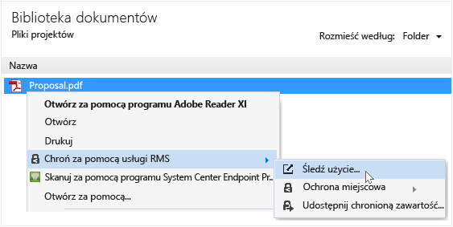

# Śledzenie i odwołać dokument&#243;w, gdy użytkownik korzysta z RMS sharing aplikacji
Po dokumenty mają chronione przy użyciu RMS sharing aplikacji, jeśli w organizacji jest Azure Rights Management, a nie usługi zarządzania prawami dostępu w usłudze Active Directory, można śledzić, jak użytkownicy korzystają dokumentów chronionych. W razie potrzeby również można odwołać dostęp do tych dokumentów, gdy chcesz zatrzymać udostępnianie ich. Aby to zrobić, należy użyć **śledzenia witryny dokumentów**, którego można uzyskać dostęp z komputery z systemem Windows, Mac komputerów, a nawet z tabletów i telefonów.

> [!TIP]
> Dwóch minutę wideo: [Śledzenie Azure RMS dokumentu i odwołania](http://channel9.msdn.com/Series/Information-Protection/Azure-RMS-Document-Tracking-and-Revocation)

Podczas uzyskiwania dostępu do tej witryny, zaloguj się do śledzenia dokumentów. Dostarczanie organizacji ma [subskrypcji obsługującego śledzenia dokumentu i odwołania](https://technet.microsoft.com/dn858608.aspx) i przypisanych licencji dla tej subskrypcji, następnie widać kto próbował otwierania plików, które możesz chronić i określa, czy zostały pomyślnie (zostali pomyślnie uwierzytelnieni) lub nie. Za każdym razem, ich próbował uzyskać dostęp do dokumentu i ich lokalizacji w czasie. Ponadto:

-   Jeśli chcesz zatrzymać udostępnianie dokumentu: Kliknij przycisk **odwołać dostęp**, należy zwrócić uwagę okres czasu, przez który dokumentu będzie ona dostępna i zdecydować, czy na poinformowanie ludzi, że w przypadku unieważnienie dostępu do dokumentu należy wcześniej udostępniony i dostarczyć niestandardowy komunikat.

-   Jeśli chcesz wyeksportować do programu Excel: Kliknij przycisk **otwarty w programie Excel**, tak aby można zmodyfikować dane i tworzyć własne widoki i wykresy.

-   Jeśli chcesz skonfigurować powiadomienia e-mail: Kliknij przycisk **Ustawienia** i wybierz jak i czy ma być przesłane pocztą e-mail przy uzyskiwaniu dostępu do dokumentu.

-   Jeśli masz pytania lub chcesz Wyraź swoją opinię dotyczącą śledzenia witryny dokumentów: Kliknij ikonę Pomoc, aby uzyskać dostęp do [często zadawane pytania dotyczące śledzenia dokumentu](http://go.microsoft.com/fwlink/?LinkId=523977).

## Dostęp do dokumentu śledzenia witryny za pomocą pakietu Office

-   Dla pakietu Office aplikacji, Word, Excel i PowerPoint: Na **Strona główna** kartę w **RMS** kliknij polecenie **Udostępnij chronione**, a następnie kliknij przycisk **użycie ścieżki**.

    

-   Dla programu Outlook: Na **Strona główna** kartę w  **RMS** kliknij polecenie **użycie ścieżki**:

    

Jeśli te opcje dla usług RMS nie są widoczne, istnieje duże prawdopodobieństwo, że RMS sharing aplikacji nie jest zainstalowany na komputerze, nie jest zainstalowana najnowsza wersja albo należy ponownie uruchomić komputer, aby ukończyć instalację. Aby uzyskać więcej informacji na temat sposobu zainstalowania udostępniania aplikacji, zobacz [Pobierz i zainstaluj Rights Management udostępnianie aplikacji](../Topic/Download_and_install_the_Rights_Management_sharing_application.md).

### Inne sposoby śledzenia i odwołać dokumentów
Oprócz śledzenie dokumentów na komputerach z systemem Windows przy użyciu aplikacji pakietu Office, możesz także użyć tych możliwości:

-   **w przeglądarce sieci web**: Ta metoda będzie działał dla wszystkich obsługiwanych urządzeń.

-   **Za pomocą Eksploratora pliku**: Ta metoda działa na komputerach z systemem Windows.

-   **Za pomocą wiadomości e-mail programu Outlook**: Ta metoda działa na komputerach z systemem Windows.

##### W przeglądarce sieci web dostępu do witryny śledzenia dokumenty

-   Za pomocą przeglądarki, przejdź do [śledzenia witryny dokumentów](http://go.microsoft.com/fwlink/?LinkId=529562).

    Obsługiwanych przeglądarek: Zaleca się użycie programu Internet Explorer, która jest co najmniej w wersji 10, ale można użyć dowolnej z następujących przeglądarkach do użycia w dokumencie śledzenia witryny:

    -   Internet Explorer: Co najmniej w wersji 10

    -   Program Internet Explorer 9 z co najmniej MS12-037: Zbiorcza aktualizacja zabezpieczeń dla programu Internet Explorer: 12 czerwca 2012 r.

    -   Mozilla Firefox: Co najmniej w wersji 12

    -   Apple Safari 5: Co najmniej w wersji 5

    -   Google Chrome: Co najmniej 18 wersji

##### Dostęp do dokumentu śledzenia witryny za pomocą Eksploratora plików

-   Kliknij prawym przyciskiem myszy plik, wybierz opcję **Zabezpieczenia z usług RMS**, a następnie wybierz **użycie ścieżki**:

    

##### Za pomocą wiadomości e-mail programu Outlook dostępu do witryny śledzenia dokumenty

-   W wiadomości e-mail w **komunikat** kartę w  **RMS** kliknij polecenie **Udostępnij chronione**, a następnie kliknij przycisk **użycie ścieżki**:

    

## Inne instrukcje i przykłady
Przykłady dla sposobu wykorzystania Rights Management udostępnianie aplikacji i instrukcje dotyczące wykonywania określonych zadań w następujących sekcjach z Podręcznik użytkownika aplikacji udostępniania Rights Management:

-   [Przykłady korzystania z aplikacji do udostępniania RMS](../Topic/Rights_Management_sharing_application_user_guide.md#BKMK_SharingExamples)

-   [Co chcesz zrobić?](../Topic/Rights_Management_sharing_application_user_guide.md#BKMK_SharingInstructions)

## Zobacz też
[Przewodnik użytkownika aplikacji udostępniania zarządzania prawami dostępu](../Topic/Rights_Management_sharing_application_user_guide.md)

