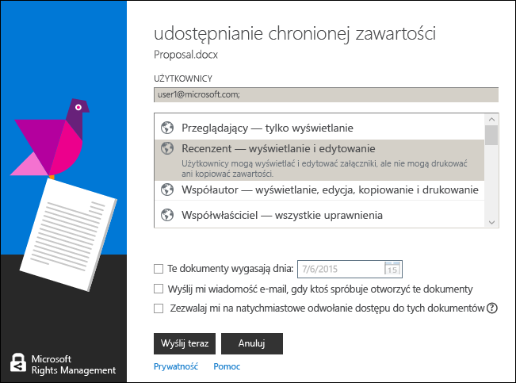

# Używanie skr&#243;t&#243;w klawiaturowych Rights Management udostępnianie aplikacji
Jeśli używasz RMS sharing aplikacji, naciśnij klawisz **Alt** klawisz, aby wyświetlić klucze dostępu, a następnie naciśnij klawisz **Alt** + klucz dostępu, aby wybrać opcję.

Na przykład w **Udostępnij chronione** okno dialogowe, naciśnij klawisz **Alt** do wyświetlenia kluczy dostępu, a następnie naciśnij klawisz **Alt + m** do wyboru **E-mail mnie, gdy ktoś spróbuje otworzyć te dokumenty** pole wyboru.

## Inne instrukcje i przykłady
Przykłady dla sposobu wykorzystania Rights Management udostępnianie aplikacji i instrukcje dotyczące wykonywania określonych zadań w następujących sekcjach z Podręcznik użytkownika aplikacji udostępniania Rights Management:

-   [Przykłady korzystania z aplikacji do udostępniania RMS](../Topic/Rights_Management_sharing_application_user_guide.md#BKMK_SharingExamples)

-   [Co chcesz zrobić?](../Topic/Rights_Management_sharing_application_user_guide.md#BKMK_SharingInstructions)

## Zobacz też
[Przewodnik użytkownika aplikacji udostępniania zarządzania prawami dostępu](../Topic/Rights_Management_sharing_application_user_guide.md)

