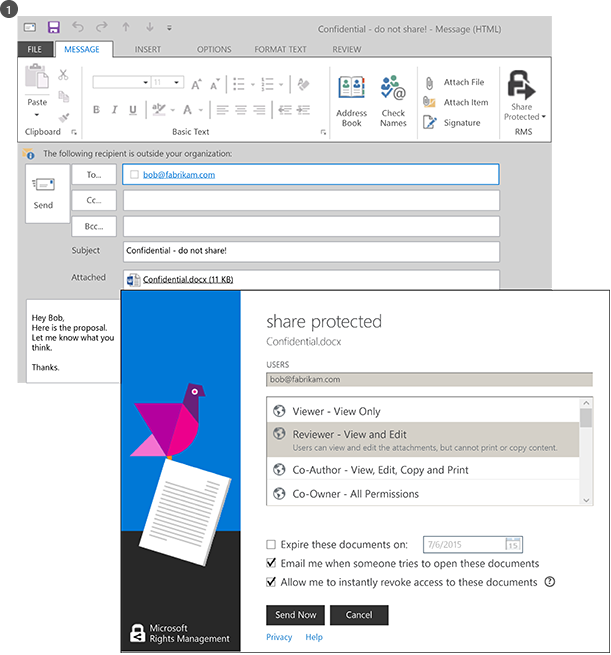
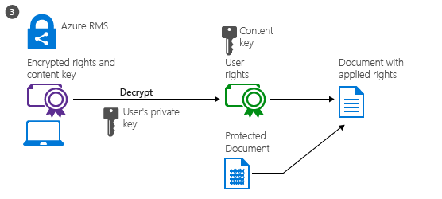

# Co to jest Azure Rights Management?
Azure Rights Management (usług Azure RMS) to rozwiązanie ochrony informacji dla organizacji, które chcesz chronić swoje dane w dzisiejszym trudne środowiska pracy.

Te problemy, obejmują trzeba mieć połączenie internetowe, użytkownikom przywracanie urządzenie osobiste do pracy, uzyskiwanie dostępu do danych firmy na drodze i głównej i udostępnianie informacji poufnych z partnerami biznesowymi ważne. W ramach swojej codziennej pracy użytkowników udostępnianie informacji za pomocą poczty e-mail, udostępnianie plików witryn i usług w chmurze. W tych scenariuszach kontroli bezpieczeństwa tradycyjny (takie jak listy kontroli dostępu i uprawnienia NTFS) i zapory ograniczoną skuteczność, aby chronić dane firmy podczas nadal nadawania uprawnień operacjom użytkownikom wydajną pracę.

Porównania usług Azure RMS można chronić informacje poufne firmy w tych scenariuszach. Używa szyfrowania, tożsamości i zasady autoryzacji do zabezpieczania plików i wiadomości e-mail i działa na wielu urządzeniach — telefonach, tablety i komputery. Informacje mogą być chronione w obrębie organizacji i spoza organizacji, ponieważ ochrony pozostaje z danymi, nawet wtedy, gdy pozostawia granice w organizacji. Na przykład pracownicy mogą dokumentu pocztą e-mail do firmy partnera lub zapisywania dokumentu do ich dysku chmury. Trwałe ochrony, który dostarcza usług Azure RMS nie tylko pomaga zabezpieczyć dane firmowe, ale także może być prawnie obowiązkowe zgodności, wymagań prawnych odnajdywania lub po prostu dobre informacje rozwiązań z zakresu zarządzania.

Ale bardzo ważne, można kontynuować upoważnione osoby i usługi (na przykład wyszukiwanie i indeksowanie) do odczytywania i sprawdź dane, które chroni usług Azure RMS, i nie jest łatwo realizowane przy użyciu innych rozwiązań ochrony informacji, które szyfrowania peer-to-peer. Ta możliwość jest czasami określany jako "uzasadnienie nad danymi" i jest czynnikiem decydującym zachowując kontrolę nad danymi w organizacji.

Na poniższej ilustracji pokazano, jak usług Azure RMS działa jako rozwiązanie Rights Management dla Office 365 jak w przypadku serwerów lokalnych i usług. Zostaną również wyświetlone obsługuje urządzenia popularnych użytkownika końcowego, z systemem Windows, Mac OS, iOS, Android i Windows Phone.

> [!TIP]
> W tym momencie może być przydatne dodatkowych zasobów:
> 
> -   Dwie minuty wideo: [Co to jest Microsoft Azure Rights Management](http://technet.microsoft.com/dn833005.aspx)
> -   Samouczek krok 5: [Samouczek Szybki Start Azure Rights Management](../Topic/Quick_Start_Tutorial_for_Azure_Rights_Management.md)
> -   Azure RMS wymagań, w tym opcje subskrypcji do zakupu lub oceny: [Wymagania dotyczące systemu Azure Rights Management](../Topic/Requirements_for_Azure_Rights_Management.md)

Skorzystaj z następujących sekcji, aby dowiedzieć się więcej na temat usług Azure RMS:

-   [Jakie problemy rozwiązuje usług Azure RMS?](../Topic/What_is_Azure_Rights_Management_.md#BKMK_RMSrequirements)

    -   [Wymagania dotyczące przepisami, zgodności i zabezpieczeń](../Topic/What_is_Azure_Rights_Management_.md#BKMK_RMScompliance)

-   [Azure RMS w akcji: Administratorzy i użytkownicy wyświetlanych](../Topic/What_is_Azure_Rights_Management_.md#BKMK_RMSpictures)

    -   [Aktywowanie i konfigurowanie Rights Management](../Topic/What_is_Azure_Rights_Management_.md#BKMK_Example_ManagementPortal)

    -   [Automatycznie ochrony plików na serwerach plików z systemem Windows Server i infrastruktury klasyfikacji plików](../Topic/What_is_Azure_Rights_Management_.md#BKMK_Example_FCI)

    -   [Automatycznie ochrona wiadomości e-mail z programu Exchange Online i zasady zapobiegania utracie danych](../Topic/What_is_Azure_Rights_Management_.md#BKMK_Example_DLP)

    -   [Automatycznie ochrony plików za pomocą usługi SharePoint Online i bibliotek chronionych](../Topic/What_is_Azure_Rights_Management_.md#BKMK_Example_SharePoint)

    -   [Użytkownicy bezpiecznie udostępniać załączniki użytkowników mobilnych](../Topic/What_is_Azure_Rights_Management_.md#BKMK_Example_SharingApp)

-   [Jak działa usług Azure RMS Pod wyciągiem](../Topic/What_is_Azure_Rights_Management_.md#BKMK_HowRMSworks)

    -   [Formantów kryptograficznych używanych przez usług Azure RMS: Algorytmy i długości kluczy](../Topic/What_is_Azure_Rights_Management_.md#BKMK_RMScrytographics)

    -   [Wskazówki działania usług Azure RMS: Najpierw użyj, zawartości ochrony zawartości zużycie](../Topic/What_is_Azure_Rights_Management_.md#BKMK_Walthrough)

-   [Następne kroki](../Topic/What_is_Azure_Rights_Management_.md#BKMK_NextSteps)

## Jakie problemy rozwiązuje usług Azure RMS?
Użyj poniższej tabeli, aby zidentyfikować problemy, które organizacja może mieć lub wymagań biznesowych i jak usług Azure RMS może zająć się one.

|Wymaganie lub problem|Rozwiązany przez usług Azure RMS|
|-------------------------|------------------------------------|
|Ochronę wszystkich typów plików|√ w poprzedniej implementacji Rights Management, Office tylko pliki mogą być chronione, za pomocą ochrony natywnej. Teraz [Ochrona ogólna](https://technet.microsoft.com/library/dn574738%28v=ws.10%29.aspx) oznacza, że wszystkie typy plików są obsługiwane.|
|Ochrona plików z dowolnego miejsca|√, gdy plik jest zapisywany w lokalizacji ([Ochrona miejscowa](https://technet.microsoft.com/library/dn574733%28v=ws.10%29.aspx)), ochrony jest skojarzona z pliku, nawet jeśli jest kopiowany do magazynu, który nie jest pod kontrolą IT, takich jak usługi magazynu w chmurze.|
|Bezpieczne udostępnianie plików za pośrednictwem poczty e-mail|√, gdy plik jest udostępnione za pośrednictwem poczty e-mail ([udziale chronionym](https://technet.microsoft.com/library/dn574735%28v=ws.10%29.aspx)), plik jest chroniony jako załącznik do wiadomości e-mail z instrukcjami sposób otwierania chronionego załącznika. Tekst wiadomości e-mail nie są szyfrowane, więc adresat może otworzyć te instrukcje. Jednak ponieważ dołączony dokument jest chroniony, tylko autoryzowani użytkownicy będą mogli otworzyć go, nawet jeśli adres e-mail lub dokumentu jest przesyłane dalej do innych osób.|
|Monitorowanie i inspekcji|Możesz √ [inspekcji i monitorowania użycia](https://technet.microsoft.com/library/dn529121.aspx) pliki chronione, nawet po granice organizacji pozostawić te pliki.  Na przykład użytkownik pracuje dla firmy Contoso, Ltd. Pracujesz nad projektem wspólnego osobom 3 firmy Fabrikam, Inc. Te osoby 3 e-mail dokument chronić i ograniczyć tylko do odczytu. Inspekcja Azure RMS można podać następujące informacje:  -   Czy osób określonych w Fabrikam otworzyć dokument i kiedy. -   Czy inne osoby, która nie określono prób (i nie powiodła się) do otwarcia dokumentu — prawdopodobnie ponieważ został przekazany albo zapisać w lokalizacji udostępnionej, dostępnym dla innych. -   Czy dowolny z określonej osoby próbowała (i nie powiodła się) aby wydrukować lub zmian w dokumencie.|
|Obsługa wszystkich najczęściej używanych urządzeń i nie tylko komputery z systemem Windows|√ [obsługiwanych urządzeń](https://technet.microsoft.com/library/dn655136.aspx) obejmują:  -   Komputery z systemem Windows i telefony -   Komputery Mac -   iOS tablety i telefony -   Android tablety i telefony|
|Obsługa firma firma współpracy|√ Ponieważ usług Azure RMS to usługa w chmurze, nie istnieje potrzeba jawnie skonfigurować relacje zaufania z innymi organizacjami przed udostępnieniem chronionej zawartości z nimi. Jeżeli mają usługi Office 365 lub katalogu usługi Azure AD, automatycznie jest obsługiwana współpracy w organizacji. Nie, użytkownicy mogą rejestrować się wolnych [usług RMS dla osób](https://technet.microsoft.com/library/dn592127.aspx) subskrypcji.|
|Obsługa usług lokalnych, jak również usługi Office 365|√ Oprócz pracy [bezproblemowo z usługi Office 365](https://technet.microsoft.com/library/jj585004.aspx), umożliwia także usług Azure RMS za pomocą następujących usług lokalnych podczas wdrażania [łącznika usług RMS](https://technet.microsoft.com/library/dn375964.aspx):  -   Exchange Server -   Serwer programu SharePoint -   Uruchamianie infrastruktury klasyfikacji plików systemu Windows Server|
|Łatwe aktywacji|√ [Aktywowanie usługi Rights Management](https://technet.microsoft.com/library/jj658941.aspx) dla użytkowników wymaga zaledwie kilka kliknięć w portalu Azure klasycznego.|
|Możliwość skalowania w organizacji, w razie potrzeby|√, ponieważ usług Azure RMS działa jako usługa w chmurze z elastyczności Azure skalowanie w górę i limit, nie trzeba udostępnić lub wdrożyć dodatkowe na serwerach lokalnych.|
|Możliwość tworzenia proste i elastyczne zasady|√ [dostosowywać szablony zasad praw](https://technet.microsoft.com/library/dn642472.aspx) jest rozwiązaniem w szybkim i łatwym Administratorzy mogą stosować zasady i dla użytkowników zastosować odpowiedniego poziomu ochrony dla każdego dokumentu i ograniczyć dostęp do osób w Twojej organizacji.  Na przykład dla papieru strategii całej firmy mają być współużytkowane przez wszystkich pracowników, tylko do odczytu zasad można zastosować do wszystkich pracowników firmy. Następnie bardziej rygorystyczne dokumentu, takie jak raportu finansowego, można ograniczyć dostęp do dyrektorów tylko.|
|Obsługa aplikacji szerokie|√ usług Azure RMS ma ścisłej integracji z aplikacjami Microsoft Office i usługami i oferuje rozszerzone wsparcie dla innych aplikacji za pomocą aplikacji RMS sharing.  √   [Microsoft Rights Management SDK](https://msdn.microsoft.com/library/hh552972%28v=vs.85%29.aspx) oferuje sieci wewnętrznej deweloperom i dostawców oprogramowania za pomocą interfejsów API do pisania aplikacji niestandardowe, które obsługują usług Azure RMS.  Aby uzyskać więcej informacji, zobacz [Jak aplikacje obsługują Azure Rights Management](../Topic/How_Applications_Support_Azure_Rights_Management.md).|
|IT muszą zachować kontrolę nad danymi|√ Organizacji można wybrać do zarządzania klucz dzierżawcy oraz "[Przełącz swój własny klucz](https://technet.microsoft.com/library/dn440580.aspx)" rozwiązania (BYOK) i przechowywania ich klucza dzierżawy sprzętowych modułów zabezpieczeń (HSM).  √ Obsługa inspekcji i [Rejestrowanie użycia](https://technet.microsoft.com/library/dn529121.aspx) dzięki czemu można analizować informacji szczegółowych biznesowych, monitorować nadużycie, i (Jeśli masz przeciek informacji) wykonywać analizy śledczej.  √ Delegowani dostępu za pomocą [funkcji administratorów](https://technet.microsoft.com/library/mt147272.aspx) zapewnia, że IT może zawsze dostęp do zawartości chronionej, nawet jeśli dokument był chroniony przez pracownika, który następnie pozostawia organizacji. W odróżnieniu, peer-to-peer szyfrowania rozwiązań ryzyko przegrywająca dostępu do danych firmowych.  Synchronizuj √ [tylko atrybutów katalogu, które wymaga usług Azure RMS](https://azure.microsoft.com/documentation/articles/active-directory-aadconnectsync-attributes-synchronized/) do obsługi tożsamości wspólnych dla konta usługi Active Directory lokalnie przy użyciu [Narzędzia synchronizacji katalogów](https://azure.microsoft.com/documentation/articles/active-directory-aadconnect-get-started-tools-comparison/), takich jak Azure AD Connect.  √ Włączyć logowania jednokrotnego bez replikacji haseł w chmurze za pomocą usług AD FS.  √ Organizacje zawsze może zatrzymać bez utraty dostępu do zawartości, która była wcześniej chroniona przez usług Azure RMS za pomocą usług Azure RMS. Informacje o likwidowaniu opcji, zobacz [Likwidowanie i dezaktywowanie Azure Rights Management](../Topic/Decommissioning_and_Deactivating_Azure_Rights_Management.md). Ponadto można organizacji, którzy wdrożyli prawa usługi zarządzania Active Directory (AD RMS) [migracji do usługi Azure RMS](https://technet.microsoft.com/library/dn858447.aspx) bez utraty dostępu do danych, który wcześniej był chroniony przez usługi AD RMS.|
> [!TIP]
> Jeśli znasz lokalnej wersji usług Rights Management prawa usługi zarządzania Active Directory (AD RMS), może Cię zainteresować Tabela porównawcza z [Porównanie Azure Rights Management i usług AD RMS](../Topic/Comparing_Azure_Rights_Management_and_AD_RMS.md).

### Wymagania dotyczące przepisami, zgodności i zabezpieczeń
Azure RMS obsługuje następujące zabezpieczeń, zgodności i wymaganiom prawnym:

√ Wykorzystania kryptografii standardowe i obsługuje FIPS 140-2. Aby uzyskać więcej informacji, zobacz [Formantów kryptograficznych używanych przez usług Azure RMS: Algorytmy i długości kluczy](../Topic/What_is_Azure_Rights_Management_.md#BKMK_RMScrytographics) w tym temacie.

√ Centrum pomocy technicznej firmy Thales sprzętu zabezpieczeń modułów (HSM), aby przechowywać klucz dzierżawcy w danych Microsoft Azure. Usług Azure RMS używa pieczenie zabezpieczeń dla swoich centrów danych w Ameryce Północnej, EMEA (Europa, Bliski Wschód i Afryka) i Azji, klucze można użyć tylko w danym regionie.

√ Certyfikowanych dla następujących elementów:

-   ISO/IEC 27001:2013 (obejmuje [27018 ISO/IEC](http://azure.microsoft.com/blog/2015/02/16/azure-first-cloud-computing-platform-to-conform-to-isoiec-27018-only-international-set-of-privacy-controls-in-the-cloud/))

-   Poświadczenia SSAE 2 SOC 3402 16/ISAE

-   BAA ZARZĄDZANIA

-   Klauzula modelu UE

-   FedRAMP w ramach usługi Azure Active Directory certyfikacji usługi Office 365, wystawiony urzędu agencji FedRAMP Operate przez HHS

-   PCI DSS poziomu 1

Aby uzyskać więcej informacji o tych certyfikatów zewnętrznych, zobacz [Centrum zaufania usługi Azure](http://azure.microsoft.com/support/trust-center/compliance/).

## Azure RMS w akcji: Administratorzy i użytkownicy wyświetlanych
Pokaż obrazy w tej sekcji Przykłady typowy sposób administratorzy i użytkownicy mogą zobaczyć i mogą używać usług Azure RMS w celu ochrony poufnych informacji.

> [!NOTE]
> We wszystkich tych przykładach gdzie usług Azure RMS chroni dane właściciela zawartości nadal mają pełny dostęp do danych (plik lub adres e-mail), nawet jeśli zastosowane ochrony przyznaje uprawnienia do grupy, która jest właścicielem nie jest członkiem lub nawet wtedy, gdy ochrona zastosowane obejmuje datę wygaśnięcia.
> 
> Podobnie IT może zawsze dostęp do chronionych danych bez ograniczeń, za pomocą funkcji administratorów Rights Management, przyznająca delegowanego dostęp do autoryzowanych użytkowników lub usług, które określisz. Ponadto IT może śledzenie i monitorowanie użycia danych, który jest chroniony — na przykład, który uzyskuje dostęp do danych i kiedy.

Dla innych zrzuty ekranu i filmy wideo pokazujące RMS w akcji Sprawdź [portalu usługi Microsoft Rights Management](http://www.microsoft.com/rms),  [Blog zespołu programu Microsoft Rights Management (RMS)](http://blogs.technet.com/b/rms), i [nadzorowana zawartości dla usług Azure RMS na Curah! lokacji](http://curah.microsoft.com/Search?query="Azure%20RMS").

### Aktywowanie i konfigurowanie Rights Management
Chociaż można używać środowiska Windows PowerShell, aby uaktywnić i skonfigurować usług Azure RMS, najłatwiej za pomocą portalu zarządzania. Jak aktywować usługi, ma dwa szablony domyślne tego Administratorzy i użytkownicy mogą wybrać, aby szybko i łatwo zastosować ochrony informacji w plikach. Ale można również utworzyć niestandardowe szablony dla dodatkowych opcji i ustawień.

|||
|-|-|
|  [Pełny obraz](http://technet.microsoft.com/98d53a12-3b19-4622-bb1e-75ef56df5438) (domyślnie w tym samym oknie przeglądarki)|Można użyć albo w Centrum administracyjnym usługi Office 365 (najpierw obraz) lub klasycznego portalu Azure (drugi obraz), aby aktywować RMS.  Wystarczy jedno kliknięcie, aby uaktywnić i innym kliknij, aby potwierdzić, a następnie ochrony informacji jest włączony dla administratorów i użytkowników w organizacji.|
|  [Pełny obraz](http://technet.microsoft.com/596e4fec-124c-41b1-8efd-63d5179193fb) (domyślnie w tym samym oknie przeglądarki)|Po aktywacji dwóch szablonach zasad praw są automatycznie dostępne dla Twojej organizacji. Jeden szablon jest tylko do odczytu (**tylko poufne widok** jest uwzględniona w nazwie), druga do odczytu i modyfikowania dostępu do (**poufne**).  Te szablony są stosowane do plików lub wiadomości e-mail, one ograniczyć dostęp do użytkowników w organizacji. Jest to bardzo szybki i łatwy sposób zapobiec danych firmowych przeciek osobom spoza organizacji. **Tip:** Możesz łatwo rozpoznać te domyślne szablony, ponieważ są one automatycznie poprzedzony organizacji. nazwa. W naszym przykładzie **VanArsdel, Ltd**. Jeśli chcesz, aby wyświetlić te szablony użytkownicy lub jeśli chcesz tworzyć własne szablony, można to zrobić z klasycznego portalu Azure. Jak pokazano na tym obrazie, Kreator przeprowadza użytkownika przez proces tworzenia niestandardowego szablonu.|
|  [Pełny obraz](http://technet.microsoft.com/f5df80e5-efc9-4c0f-91be-060225977356) (domyślnie w tym samym oknie przeglądarki)|Dostęp w trybie offline, ustawienia wygaśnięcia i natychmiast publikowanie szablonu (stał się widoczny w aplikacjach, które obsługują Rights Management) są niektóre ustawienia konfiguracji dostępne w razie tworzyć własne szablony.|
|  [Pełny obraz](http://technet.microsoft.com/597a3402-fd5a-4bcf-b5e6-5c983dbde697) (domyślnie w tym samym oknie przeglądarki)|W wyniku publikowania tych szablonów, użytkowników można teraz wybrać je w aplikacjach, takich jak Microsoft Word i Eksploratora plików:  -   Użytkownik może wybrać szablon domyślny **VanArsdel, Ltd – poufne**. Następnie tylko pracowników z organizacji VanArsdel można otwierać i używać tego dokumentu, nawet jeśli jego później pocztą e-mail do osób spoza organizacji lub zapisany w ogólnodostępnej lokalizacji. -   Użytkownik może wybrać niestandardowy szablon utworzony przez administratora, **sprzedaży i marketingu – odczytu i Drukuj tylko**. Następnie nie tylko plik jest chroniony od osób spoza organizacji, ale również jest ograniczony do pracowników z sprzedaży i marketingu dział. Ponadto pracownicy ci nie mają pełne prawa do dokumentu, tylko do odczytu i drukowanie. Na przykład nie można go zmodyfikować ani kopiować z niego.|
Aby uzyskać więcej informacji, zobacz [Aktywowanie Azure Rights Management](../Topic/Activating_Azure_Rights_Management.md) i [Konfigurowanie niestandardowych szablonów Azure Rights Management](../Topic/Configuring_Custom_Templates_for_Azure_Rights_Management.md).

Aby ułatwić użytkownikom ochronę firmy ważnych plików, zobacz [Ułatwienie użytkownikom ochronę plików przy użyciu systemu Azure Rights Management](../Topic/Helping_Users_to_Protect_Files_by_Using_Azure_Rights_Management.md).

Następnie zobacz przykłady jak Administratorzy mogą zastosować szablony, aby automatycznie skonfigurować ochrony informacji dla plików i wiadomości e-mail.

### Automatycznie ochrony plików na serwerach plików z systemem Windows Server i infrastruktury klasyfikacji plików
Ten przykład pokazuje, jak za pomocą usług Azure RMS można automatycznie chronić pliki na serwerach plików, w których jest uruchomiony co najmniej system Windows Server 2012 i są skonfigurowane do używania pliku klasyfikacji infrastruktury.

Istnieje wiele sposobów, aby zastosować wartości klasyfikacji dla plików. Na przykład możesz sprawdzić zawartość plików i w związku z tym stosować wbudowane klasyfikacji, takie jak informacje osobiste użytkownika i poufności. Jednak w tym przykładzie administrator tworzy niestandardowe klasyfikacji **Marketing** jest automatycznie stosowane do wszystkich dokumentów użytkownika, które są zapisywane w **Marketing promocje** folder. Mimo że ten folder jest chroniony za pomocą uprawnień NTFS, które ogranicza dostęp do członków grupy obrotu, administrator wie tych uprawnień można utracone jeśli ktoś z danej grupy przenosi lub wiadomości e-mail z plików. Następnie informacje w plikach może być używany przez nieautoryzowanych użytkowników.

|||
|-|-|
|  [Pełny obraz](http://technet.microsoft.com/cf18c56b-c301-4640-8d9e-9e677e494091) (domyślnie w tym samym oknie przeglądarki)|Administratorzy instaluje i konfiguruje Łącznik Rights Management (RMS), który działa jako przekazywania między na serwerach lokalnych i usług Azure RMS.|
|  [Pełny obraz](http://technet.microsoft.com/ba3e247d-ea5e-4009-8eac-74f70270ece0) (domyślnie w tym samym oknie przeglądarki)|Na serwerze plików administrator konfiguruje reguły klasyfikacji i zadania, aby wszystkie pliki użytkownika w **Marketing promocje** folderu są automatycznie zaliczane jako **Marketing** i chronione przy użyciu szyfrowania RMS.  Wybiera szablon niestandardowy RMS, który został utworzony w naszym przykładzie pierwsze, który ogranicza dostęp do elementów członkowskich sprzedaży i marketingu działów: **Sprzedaży i marketingu – odczytu i drukować tylko**.  W efekcie wszystkie dokumenty w tym folderze są automatycznie skonfigurowany z klasyfikacją obrotu i chronione sprzedaży i marketingu usług RMS szablonu.|
|  [Pełny obraz](http://technet.microsoft.com/ad666594-68df-4289-835a-235b2af9bf4b) (domyślnie w tym samym oknie przeglądarki)|Jak RMS pomaga zapobiec przeciek do osób, które nie powinny mieć dostępu do informacji poufnych danych:  -   Janet, ze sprzedaży, wiadomości e-mail poufne raportu w folderze Marketing promocji. Ten raport zawiera nowe funkcje produktu i planów reklamy i żąda współpracownika, który jest obecnie podróży działalność. Jednak Janet przez pomyłkę wiadomości e-mail go do niewłaściwej osoby — użytkownik nie zauważyć klika przypadkowo wybranego adresata o podobnej nazwie w innej firmy.     Odbiorca nie może odczytać poufne raportu, ponieważ nie jest on członkiem sprzedaży i marketingu.|
Aby uzyskać więcej informacji, zobacz [Łącznik zarządzania Azure prawa wdrażania](../Topic/Deploying_the_Azure_Rights_Management_Connector.md).

### Automatycznie ochrona wiadomości e-mail z programu Exchange Online i zasady zapobiegania utracie danych
Poprzedni przykład pokazano, jak można automatycznie chronić pliki zawierające informacje poufne, ale co zrobić, jeśli informacje są nie w pliku, ale w wiadomości e-mail? Jest to, skąd pochodzą usługi Exchange Online zasady zapobiegania (DLP) utraty danych, monitowania użytkowników, aby zastosować ochrony informacji (za pomocą zasad porady) albo automatyczne stosowanie dla nich (za pomocą reguł transportu).

W tym przykładzie administrator konfiguruje zasady, aby zapewnić organizacji z zasadami nam przepisy dotyczące ochrony danych identyfikowalne dane osobowe, ale można również skonfigurować reguły dla innych rozporządzeń zgodności lub niestandardowych reguł zdefiniowanych przez użytkownika.

|||
|-|-|
|  [Pełny obraz](http://technet.microsoft.com/58461319-3981-4b7f-a195-956a1778e907) (domyślnie w tym samym oknie przeglądarki)|Szablon programu Exchange o nazwie **USA Danych umożliwiających identyfikowalne dane osobowe** jest używana przez administratora, aby utworzyć i skonfigurować nową zasadę DLP. Ten szablon szuka informacje takie jak numer PESEL i liczby licencji sterownika w wiadomości e-mail.  Zasady są skonfigurowane tak, aby wiadomości e-mail, która zawiera te informacje i automatycznie, które są wysyłane poza organizacją mają prawa ochrony stosowany przy użyciu szablonu usług RMS, który ogranicza dostęp do tylko pracownicy firmy.  W tym miejscu zasada jest skonfigurowana do korzystania z jednego z szablonów domyślnych **VanArsdel, Ltd – poufne**, z pierwszy przykład. Ale można również sprawdzić, jak wybór szablony obejmuje wszystkie szablony niestandardowe zostały utworzone, a **nie należy do przodu** opcji, które są specyficzne dla programu Exchange.|
|  [Pełny obraz](http://technet.microsoft.com/bfb0762d-06fb-42e4-beff-eb391f4bedf0) (domyślnie w tym samym oknie przeglądarki)|Menedżer zatrudniania zapisuje wiadomość e-mail zawierającą numeru NIP ostatnio zatrudniania pracownika. ADAM wysyła wiadomości e-mail do Sherrie w dziale zasobów ludzkich.|
|  [Pełny obraz](http://technet.microsoft.com/59e3b68e-4bed-4962-bb1e-e82d82f8000a) (domyślnie w tym samym oknie przeglądarki)|Jeśli ta wiadomość e-mail jest wysyłane lub przekazywane do osób spoza organizacji, DLP automatycznie regułą ochrony praw.  Wiadomości e-mail są szyfrowane, gdy pozostawia infrastrukturą w organizacji, tak aby nie można odczytać adres e-mail w wiadomości e-mail, gdy podczas przesyłania lub w skrzynce odbiorczej. Odbiorca nie będzie mógł czytać wiadomości, chyba że użytkownik jest pracownika VanArsdel.|
Aby uzyskać więcej informacji zobacz następujące sekcje:

-   [Exchange Online i Exchange Server](../Topic/How_Applications_Support_Azure_Rights_Management.md#BKMK_ExchangeIntro) w [Jak aplikacje obsługują Azure Rights Management](../Topic/How_Applications_Support_Azure_Rights_Management.md) tematu.

-   [Exchange Online: Konfiguracja usługi IRM](../Topic/Configuring_Applications_for_Azure_Rights_Management.md#BKMK_ExchangeOnline) w [Konfigurowanie aplikacji Azure Rights Management](../Topic/Configuring_Applications_for_Azure_Rights_Management.md) tematu.

### Automatycznie ochrony plików za pomocą usługi SharePoint Online i bibliotek chronionych
Pokazuje to, jak łatwo chronić dokumenty podczas korzystania z usługi SharePoint Online i bibliotek chronionych.

W tym przykładzie administrator programu SharePoint "contoso" utworzył biblioteki dla każdego działu mogą korzystać do centralnego przechowywania i zapoznaj się z dokumentów do edycji i kontroli wersji. Na przykład istnieje biblioteka sprzedaży, jeden dla obrotu, jeden na potrzeby zarządzania zasobami ludzkimi i tak dalej. Nowy dokument jest przekazywane lub utworzony w jeden z tych bibliotek chronionego, ten dokument dziedziczy ochrony biblioteki (nie ma potrzeby wybierz szablon zasad praw) i tego dokumentu jest chronione automatycznie i jest chroniony, nawet w przypadku utraci biblioteki programu SharePoint.

|||
|-|-|
|  [Pełny obraz](http://technet.microsoft.com/2fc90989-9289-4431-9e6a-07740b7f6e5a) (domyślnie w tym samym oknie przeglądarki)|Administrator umożliwia zarządzanie prawami do informacji w witrynie programu SharePoint.|
|  [Pełny obraz](http://technet.microsoft.com/a18f2e99-5ac4-4103-a88c-527846374091) (domyślnie w tym samym oknie przeglądarki)|Następnie użytkownik włącza Rights Management dla biblioteki. Mimo że dostępne są dodatkowe opcje, to ustawienie prostego jest często wszystkie potrzebne.  Gdy dokumenty teraz są pobierane z tej biblioteki, automatycznie są chronione przez usługę Rights Management, dziedziczenie ochrony skonfigurowanej dla biblioteki.|
|  [Pełny obraz](http://technet.microsoft.com/0ebd6806-0190-441e-84db-72ac4b97e4a2) (domyślnie w tym samym oknie przeglądarki)|Ktoś z działu sprzedaży wyewidencjonuje ten raport sprzedaży z biblioteki wyraźnie widzą z transparentu informacji u góry jest chroniony dokument z ograniczonym dostępem.  Dokument pozostaje chronionych, nawet jeśli użytkownik zmienia ją zapisuje ją w innej lokalizacji i udostępnia go za pośrednictwem poczty e-mail. Niezależnie od tego, co ma nazwę pliku, gdzie są przechowywane lub czy są one udostępniane za pośrednictwem poczty e-mail tylko członkowie działu sprzedaży może je odczytać.|
Aby uzyskać więcej informacji zobacz następujące sekcje:

-   [SharePoint Online i programu SharePoint Server](../Topic/How_Applications_Support_Azure_Rights_Management.md#BKMK_SharePointIntro) w [Jak aplikacje obsługują Azure Rights Management](../Topic/How_Applications_Support_Azure_Rights_Management.md) tematu.

-   [SharePoint Online i usługi OneDrive dla firm: Konfiguracja usługi IRM](../Topic/Configuring_Applications_for_Azure_Rights_Management.md#BKMK_SharePointOnline) w [Konfigurowanie aplikacji Azure Rights Management](../Topic/Configuring_Applications_for_Azure_Rights_Management.md) tematu.

### Użytkownicy bezpiecznie udostępniać załączniki użytkowników mobilnych
Poprzednich przykładach pokazano, jak Administratorzy mogą automatycznie dotyczą ochrony informacji dane poufne. Ale będzie niektórych przypadkach, gdy użytkownicy może być konieczne się zastosować ten typ ochrony. Na przykład są one współpracę z partnerami w innej organizacji, są niezbędne uprawnienia niestandardowe lub ustawienia, które nie są zdefiniowane w szablonach, aby uzyskać lub sytuacjach ad hoc, które nie są objęte poprzednich przykładach. W takich sytuacjach użytkowników można zastosować sami szablony usług RMS lub skonfigurować niestandardowe uprawnienia.

W tym przykładzie pokazano, jak użytkownicy mogą łatwo udostępniania dokumentów ktoś jest współpraca z innej firmy, ale nadal można chronić dokument i mieć pewność, że odbiorcy może czytać, nawet urządzenie przenośne popularnych. W tym scenariuszu używa Rights Management aplikacji do udostępniania, które można automatycznie wdrażać na komputerach z systemem Windows w Twojej organizacji. Lub, użytkownicy mogą instalować go samodzielnie.

W tym przykładzie Alicja z firmy Contoso, wiadomości e-mail poufny dokument programu Word, który wysyła do niego w firmy Fabrikam. On odczytuje dokument na jego iPad, ale osoba może równie proste odczytać na iPhone, Android tabletu lub telefonu, komputera Mac lub Windows phone lub komputera.

|||
|-|-|
|  [Pełny obraz](http://technet.microsoft.com/feeef78d-3c2e-432b-817d-d06f784be226) (domyślnie w tym samym oknie przeglądarki)|Ze swojego komputera Windows Alicja utworzy wiadomość e-mail standardowego i dołącza dokumentu.  Klika przycisk **Udostępnij chronione** na Wstążce, który ładuje **udziale chronionym** okno dialogowe z aplikacji RMS sharing.  Alicja chce ograniczyć Bob do wyświetlania i edytowania dokumentu, a nie ma go skopiować lub wydrukować, więc wybiera **RECENZENT — wyświetlanie i edytowanie**. Chce także przesłania pocztą e-mail, gdy ktoś spróbuje otworzyć dokument i mieć możliwość odwołać później dokument, w razie potrzeby i wiadomo, że odwołania będzie zaczynają obowiązywać natychmiast.|
|  [Pełny obraz](http://technet.microsoft.com/e748fd78-8bba-4168-96cf-f96def078283) (domyślnie w tym samym oknie przeglądarki)|Robert widzi wiadomości e-mail na jego iPad.  Oprócz Alicji wiadomość i załączniki istnieją instrukcje, które on następuje zarejestrować się i zainstalować aplikację RMS sharing na jego iPad.|
|  [Pełny obraz](http://technet.microsoft.com/7dba5ff9-a61d-4a83-8adc-d6ffb0e85df6) (domyślnie w tym samym oknie przeglądarki)|Robert teraz można otworzyć załącznik. Jest on najpierw poproszony o Zaloguj się upewnić się, że jest on odbiorca.  Gdy Bob Wyświetla dokumentu, widzi również ograniczony dostęp do danych informujących mu on wyświetlanie i edytowanie dokumentu, ale nie kopiowania lub drukowania.|
|  [Pełny obraz](http://technet.microsoft.com/9f642a2e-58ad-44ab-9f81-f890d15380f9) (domyślnie w tym samym oknie przeglądarki)|Alicja, otrzymuje wiadomość e-mail, informujący o jej Bob pomyślnie otwarcia dokumentu wysyłającego klika i kiedy on uzyskać dostępu do dokumentu.  Jeśli Bob przekazuje jego wiadomości e-mail z załącznikiem lub zapisuje je w przypadku gdy inne osoby do niego dostęp lub zostaje zatrzymana w sieci, inne osoby będą nie może odczytać dokumentu.|
Aby uzyskać więcej informacji, zobacz [Ochrona pliku udostępnionego pocztą e-mail](https://technet.microsoft.com/library/dn574735.aspx) i [Wyświetlanie i używanie plików chronionych](https://technet.microsoft.com/library/dn574741.aspx) z [Rights Management sharing przewodnik użytkownika aplikacji](https://technet.microsoft.com/library/dn339006.aspx).

Ponadto [Samouczek Szybki Start Azure Rights Management](../Topic/Quick_Start_Tutorial_for_Azure_Rights_Management.md) zawiera instrukcje krok po kroku, w tym scenariuszu.

Teraz przeczytane przykłady czynności usług Azure RMS, może Cię zainteresować jak to robi. Aby uzyskać informacje techniczne na temat działania usług Azure RMS zobacz następną sekcję.

## Jak działa usług Azure RMS Pod wyciągiem
Co ważne jest, aby zrozumieć, jak działa usług Azure RMS jest czy usługi zarządzania prawami dostępu (i firmy Microsoft) nie można znaleźć w temacie lub dane przechowywane w ramach procesu ochrony informacji. Informacje, które można chronić jest wysyłane do i przechowywane w usłudze Azure, chyba że jawnie zapisać ją w Azure lub użyj innej usługi w chmurze, który przechowuje Azure. Azure RMS po prostu sprawia, że dane w dokumencie można odczytać nikt inny oprócz autoryzowanych użytkowników i usług:

-   Dane są szyfrowane na poziomie aplikacji i zawiera zasadę, która definiuje autoryzowane użycie tego dokumentu.

-   Gdy chroniony dokument jest używany przez zwykłego użytkownika lub jest przetwarzany przez autoryzowanych usługi, danych w dokumencie i prawa, które są zdefiniowane w zasadzie są wymuszane.

Na wysokim poziomie można zobaczyć, jak ten proces działa na poniższej ilustracji. Dokument zawierający tajny formuła jest chronione i pomyślnie otwarte przez autoryzowanych użytkowników lub usług. Dokument jest chroniony przez klucz zawartości (zielony klucz ten obraz). Jest unikatowy dla każdego dokumentu i jest umieszczany w nagłówka pliku, w której jest chroniony przez klucz główny dzierżawy RMS (czerwony klucz ten obraz). Klucz dzierżawcy może być generowane i zarządzane przez firmę Microsoft lub może generować i zarządzać klucz dzierżawcy.

W trakcie procesu ochrony usług Azure RMS jest szyfrowania i odszyfrowywania, autoryzowania i wymuszanie ograniczenia, tajny formuła nigdy nie są wysyłane do usługi Azure.

Aby uzyskać szczegółowy opis co się dzieje, zobacz [Wskazówki działania usług Azure RMS: Najpierw użyj, zawartości ochrony zawartości zużycie](../Topic/What_is_Azure_Rights_Management_.md#BKMK_Walthrough) w tym temacie.

Aby uzyskać szczegółowe informacje techniczne o algorytmy i długości kluczy, które używa usług Azure RMS zobacz następną sekcję.

### Formantów kryptograficznych używanych przez usług Azure RMS: Algorytmy i długości kluczy
Nawet jeśli nie trzeba znać samodzielnie działania usług RMS, użytkownik może zostać poproszony o formanty kryptograficzne że używa on, aby upewnić się, że ochrona zabezpieczeń jest standardowym.

|||
|-|-|
|Metoda ochrony dokumentacji:|Algorytm: AES  Długość klucza: 128 bitów i 256 bitów 1|
|Metoda ochrony klucza:|Algorytm: RSA  Długość klucza: 2048 bitów|
|Podpisywanie certyfikatu:|Algorytm: SHA-256.|
1 256 bitów jest używany przez usługę Rights Management udostępniania aplikacji dla ochrony ogólnej i ochrona natywna, gdy plik ppdf ma rozszerzenie nazwy pliku lub chronionych plików tekstowych lub graficznych (na przykład ptxt lub pjpg).

### Wskazówki działania usług Azure RMS: Najpierw użyj, zawartości ochrony zawartości zużycie
Aby poznać bardziej szczegółowo działania usług Azure RMS, przeprowadź Załóżmy przez typowy przepływ po [usług Azure RMS jest aktywny](https://technet.microsoft.com/library/jj658941.aspx) i gdy użytkownik najpierw używa usług RMS na komputer z systemem Windows (procesu, zwana czasami **inicjowania środowiska użytkownika** lub inicjowanie), **chroni zawartość** (dokumentu lub adres e-mail), a następnie **zużywa**  (otwiera i używa) zawartości chronionej przez innej osobie.

Po zainicjowaniu jest środowisko użytkownika, użytkownik może następnie chronić dokumenty lub zużywać chronione dokumenty na tym komputerze.

> [!NOTE]
> Jeśli ten użytkownik zostanie przeniesiona na inny komputer z systemem Windows lub inny użytkownik korzysta z tego samego komputera systemu Windows, jest powtarzany proces inicjowania.

#### Inicjowanie środowiska użytkownika
Zanim użytkownik może chronić zawartość lub korzystać z zawartości chronionej na komputerze z systemem Windows, należy przygotować środowisko użytkownika na urządzeniu. To jest procesem jednorazowe i wykonywane automatycznie bez interwencji użytkownika, gdy użytkownik próbuje ochrony lub korzystać z zawartości chronionej:

|||
|-|-|
||Najpierw klienta RMS na komputerze nawiązuje połączenie usług Azure RMS i uwierzytelnia użytkownika za pomocą swojego konta usługi Azure Active Directory.  Konto użytkownika jest Sfederowane za pomocą usługi Azure Active Directory, to uwierzytelnianie jest automatyczne, a użytkownik nie jest monitowany o poświadczenia.|

|||
|-|-|
||Po uwierzytelnieniu użytkownika, połączenie jest automatycznie przekierowywane do dzierżawy RMS Twojej organizacji, która wystawia certyfikaty, które umożliwiają użytkownikowi uwierzytelniania do usług Azure RMS, aby można było korzystać z zawartości chronionej oraz ochrony zawartości w trybie offline.  Kopię certyfikatu użytkownika znajduje się w usług Azure RMS, dzięki czemu użytkownik zostanie przeniesiony do innego urządzenia, certyfikaty są tworzone przy użyciu tych samych kluczy.|

#### Ochrona zawartości
Gdy użytkownik chroni dokument, klienta RMS wykonuje następujące akcje niechroniony dokumentu:

|||
|-|-|
||Klient RMS tworzy klucz losowy (klucz zawartości) i szyfruje dokument przy użyciu tego klucza za pomocą algorytmu szyfrowania symetrycznego AES.|

|||
|-|-|
||Klient RMS następnie tworzy certyfikat, który obejmuje zasady dla dokumentu, albo na podstawie szablonu lub określając określone prawa do dokumentu. Ta zasada zawiera uprawnienia dla różnych użytkowników lub grup i inne ograniczenia, takie jak Data wygaśnięcia.  Klienta RMS następnie używa klucza organizacji zostały pobrane, gdy środowisko użytkownika został zainicjowany i używa ten klucz do szyfrowania klucza symetrycznego zawartości i zasad. Klient RMS podpisuje również zasady za pomocą certyfikatu użytkownika, który został uzyskany po środowisko użytkownika został zainicjowany.|

|||
|-|-|
||Na koniec klienta RMs osadza zasady w pliku z treści dokumentu szyfrowane wcześniej, wchodzących w skład chronionego dokumentu.  Ten dokument mogą być przechowywane w dowolnym miejscu lub udostępniane przy użyciu dowolnej metody, a zasady zawsze pozostaje z zaszyfrowanego dokumentu.|

#### Użycie zawartości
Gdy użytkownik chce, aby wykorzystać chronionego dokumentu, Klient RMS rozpoczyna się od żądania dostępu do usług Azure RMS:

|||
|-|-|
||Uwierzytelniony użytkownik wysyła dokument zasad i certyfikaty użytkownika do usług Azure RMS. Usługa odszyfrowuje ocenia zasad i tworzy listę praw (jeśli istnieje) użytkownik ma dla dokumentu.|

|||
|-|-|
||Usługa następnie wyodrębnia klucz AES zawartości z odszyfrowany zasad. Ten klucz jest następnie szyfrowane przy użyciu klucza publicznego użytkownika RSA uzyskaną z żądaniem.  Ponownie zaszyfrowanego klucza zawartości jest następnie osadzany w licencji użytkowania zaszyfrowane listę praw użytkownika, który jest zwracany do klienta usług RMS.|

|||
|-|-|
||Na koniec klienta RMS przyjmuje licencji użytkowania zaszyfrowane i odszyfrowuje je za pomocą swojego klucza prywatnego użytkownika. Dzięki temu Klient RMS odszyfrować treści dokumentu jest odpowiednio i wprowadzić je na ekranie.  Klient również odszyfrowuje lista praw i przekazuje je do aplikacji, która wymusza tych uprawnień w interfejsie użytkownika aplikacji.|

#### Zmiany
Poprzedni wskazówki obejmują standardowe scenariuszy, ale istnieją różne wersje:

-   **Urządzeń przenośnych**: Gdy urządzenia przenośne ochrony lub korzystanie z nich pliki z usług Azure RMS, przepływy procesu jest znacznie prostsze. Urządzenia przenośne nie najpierw przejść przez proces inicjowania użytkownika zamiast tego są niezależne każdej transakcji (w celu ochrony lub korzystać z zawartości). Zgodnie z komputerów z systemem Windows, urządzenia przenośne połączyć się z usługą Azure RMS i uwierzytelniania. Aby chronić zawartość, urządzeń przenośnych Prześlij zasady i usług Azure RMS wysyła je licencja publikowania i klucz symetryczny ochrona dokumentu. Korzystać z zawartości, gdy urządzenia przenośne połączyć się z usługą Azure RMS i uwierzytelniania, Wyślij zasad dokumentu do usług Azure RMS i zażądać użycia licencji na korzystanie z nich dokumentu. W odpowiedzi usług Azure RMS wysyła niezbędne kluczy i ograniczenia na urządzeniach przenośnych. Oba procesy używać protokołu TLS do ochrony wymiany kluczy i inne materiały.

-   **Łącznika usług RMS**: Użycie usług Azure RMS za pomocą łącznika usług RMS przepływów procesu pozostają takie same. Jedyna różnica polega na tym, że łącznik działa jako przekazywania między usług lokalnych (takich jak Exchange Server i SharePoint Server) i usług Azure RMS. Łącznik sama nie wykonuje żadnych operacji, takich jak inicjowania środowiska użytkownika ani szyfrowania lub odszyfrowywania. Po prostu przekazywania przez niego komunikacji, który zazwyczaj przejdzie do serwera usług AD RMS, obsługa Translacja między protokoły, które są używane na każdej stronie. W tym scenariuszu umożliwia używanie usług Azure RMS za pomocą usług lokalnych.

-   **Ochrony ogólnej (pfile)**: Gdy usług Azure RMS objęty chroni plik, przepływ jest zasadniczo taki sam dla ochrony zawartości z tym, że Klient RMS tworzy zasadę, która przyznaje wszystkie uprawnienia. Gdy plik jest wykorzystywana, jest odszyfrowywany, zanim zostanie przekazany do aplikacji docelowej. W tym scenariuszu umożliwia ochronę wszystkich plików, nawet jeśli w sposób macierzysty nie obsługują usług RMS.

-   **Chronionych plików PDF (ppdf)**: Gdy usług Azure RMS natywnie chroni plik pakietu Office, również tworzy kopię tego pliku i zabezpiecza go w taki sam sposób. Jedyna różnica polega na tym, że kopiowania plików jest w formacie plików PPDF, który aplikacji RMS sharing wie, jak otworzyć tylko do wyświetlania. Pozwala to scenariusz wysyłać załączniki chronione za pośrednictwem poczty e-mail, wiedząc odbiorcy na urządzeniu przenośnym zawsze będzie mogła odczytywać je, nawet jeśli urządzenie przenośne nie ma aplikacji, która natywnie obsługuje chronionych plików pakietu Office.

## Następne kroki
Aby dowiedzieć się więcej na temat usług Azure RMS, należy użyć w innych tematach w [Wprowadzenie do korzystania z systemu Azure Rights Management](../Topic/Getting_Started_with_Azure_Rights_Management.md) sekcji, takich jak [Jak aplikacje obsługują Azure Rights Management](../Topic/How_Applications_Support_Azure_Rights_Management.md) Aby dowiedzieć się, jak istniejące aplikacje można zintegrować z usług Azure RMS, aby zapewnić rozwiązanie ochrony informacji. Przegląd [Terminologia Azure Rights Management](../Topic/Terminology_for_Azure_Rights_Management.md) Tak, aby użytkownicy znający warunki, które może spotkać się jak w przypadku konfigurowania i za pomocą usług Azure RMS i upewnij się, aby Sprawdź także [Wymagania dotyczące systemu Azure Rights Management](../Topic/Requirements_for_Azure_Rights_Management.md) przed rozpoczęciem wdrażania. Jeśli chcesz przejść w prawo i wypróbuj dla siebie, użyj [Samouczek Szybki Start Azure Rights Management](../Topic/Quick_Start_Tutorial_for_Azure_Rights_Management.md).

Czy jesteś gotowy rozpocząć wdrażanie usług Azure RMS w organizacji, użyj [Mapa wdrożenia usługi zarządzania prawami systemu Azure](../Topic/Azure_Rights_Management_Deployment_Roadmap.md) kroki wdrażania i łącza, aby uzyskać instrukcje dotyczące wykonywania określonych zadań.

> [!TIP]
> Aby uzyskać dodatkowe informacje i pomoc, użyj zasoby oraz łącza w [Informacje i pomoc techniczna dla usługi Azure Rights Management](../Topic/Information_and_Support_for_Azure_Rights_Management.md).

## Zobacz też
[Wprowadzenie do korzystania z systemu Azure Rights Management](../Topic/Getting_Started_with_Azure_Rights_Management.md)

